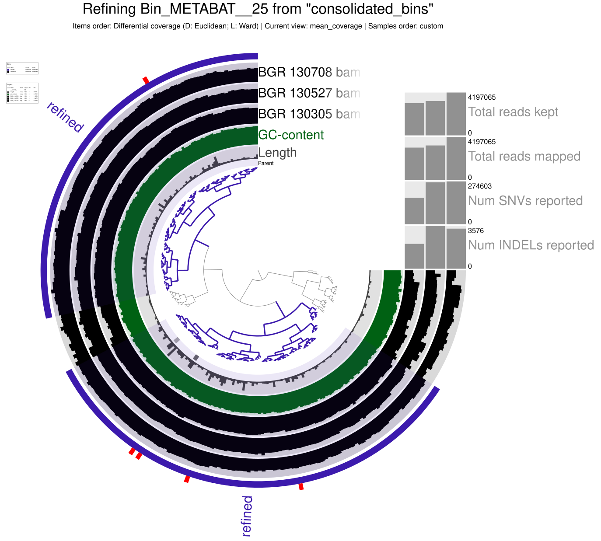

# Day 5

## Metagenomics: MAGs Quality Assesment, Bin Refinement, Taxonomic Assignment

### MAGs Quality Assessment (continuation)

Only the METABAT collection can be found. In a terminal (caucluster) the following commands were executed (in `/merged_profiles` directory).
```
srun --reservation=biol217 --pty --mem=10G --nodes=1 --tasks-per-node=1 --cpus-per-task=1 --partition=all /bin/bash
```
- node010
  
```
conda activate /home/sunam225/miniconda3/miniconda4.9.2/usr/etc/profile.d/conda.sh/envs/anvio-7.1
```
```
anvi-interactive -p /work_beegfs/sunam237/Day3/5_anvio-profiles/merged_profiles/PROFILE.db -c contigs.db -C METABAT
```
- port: 8087

In a new terminal (not on caucluster) the following commands were executed to access the interactive interface for MAGs quality assessment.
```
ssh -L 8060:localhost:8087 sunam237@caucluster-old.rz.uni-kiel.de
ssh -L 8087:localhost:8087 node010
```

The interactive interface was opened in Firefox with the address `http://127.0.0.1:8060`.


Now the complete data was used for further steps. For estimation of genome completeness (using consolidated bins) and save the results as a .txt file, the following command was executed.
```
anvi-estimate-genome-completeness -c /work_beegfs/sunam237/Day5/contigs.db -p PROFILE.db -C consolidated_bins > genome_completeness_dastool.txt
```

Questions for validation of MAGs quality assessment:

Which binning strategy gives you the best quality for the ARCHAEA bins?

- METABAT provided the best results

How many ARCHAEA bins do you get that are of High Quality? How many BACTERIA bins do you get that are of High Quality?

- 2 ARCHAEA of high quality
- 30 BACTERIA of high quality

### Bin Refinement - Preparation

The following bash script for summarizing the bins was created and executed.
```
#!/bin/bash
#SBATCH --nodes=1
#SBATCH --cpus-per-task=4
#SBATCH --mem=10G
#SBATCH --time=1:00:00
#SBATCH --job-name=anvicosummarize
#SBATCH --output=anviosummarize.out
#SBATCH --error=anviosummarize.err
#SBATCH --partition=all
#SBATCH --reservation=biol217


module load miniconda3/4.7.12.1
source activate
conda activate /home/sunam225/miniconda3/miniconda4.9.2/usr/etc/profile.d/conda.sh/envs/anvio-7.1

#anviosummarize

anvi-summarize -c /work_beegfs/sunam237/Day5/contigs.db -p /work_beegfs/sunam237/Day5/5_anvio_profiles/merged_profiles/PROFILE.db -C consolidated_bins -o /work_beegfs/sunam237/Day5/5_anvio_profiles/SUMMARY_consolidated_bins_own --just-do-it

#this prints the required resources into your logfile
jobinfo
```
### Bin Refinement - Chimera Detection in MAGs

The tool GUNC was used to detect chimeras in the previously identified archaeal MAGs "`Bin_Bin_1`" and "`Bin_METABAT__25`". For this, the following script was executed.

```
#!/bin/bash
#SBATCH --nodes=1
#SBATCH --cpus-per-task=4
#SBATCH --mem=10G
#SBATCH --time=1:00:00
#SBATCH --job-name=gunc
#SBATCH --output=gunc.out
#SBATCH --error=gunc.err
#SBATCH --partition=all
#SBATCH --reservation=biol217


module load miniconda3/4.7.12.1
source activate

#gunc

conda activate /home/sunam226/.conda/envs/gunc

cd ../ARCHAEA_BIN_REFINEMENT

mkdir GUNC

for i in *.fa; do gunc run -i "$i" -r /home/sunam226/Databases/gunc_db_progenomes2.1.dmnd --out_dir GUNC --threads 10 --detailed_output; done

#this prints the required resources into your logfile
jobinfo
```

Questions:

Do you get ARCHAEA bins that are chimeric? (hint: look at the CSS score (explained in the lecture) and the column PASS GUNC in the tables outputs per bin in your gunc_output folder)

- Yes, the bin "`Bin_Bin_1`" is `chimeric`. The bin "`Bin_METABAT__25`" is `not chimeric`.

In your own words (2 sentences max), explain what is a chimeric bin.

- In a chimeric bin, contigs from different species were mistakenly assembled into the same genomic bin. It, therefore, is a false genome and does not represent one actual species.

> A low CSS (close to 0) means within contigs, there could not be made (or only a few) different assignments of taxa (so it is most likely only from the same taxa): The bin is probably not chimeric regarding the associated taxonomic level.

### Bin Refinement - Manual Refinement

The bin "`Bin_METABAT__25`" is not chimeric and is, therefore, chosen for further processing (manual refinement). Manual refinement was done in a interactive interface, which was initiated and accessed by using the following commands.

```
srun --reservation=biol217 --pty --mem=10G --nodes=1 --tasks-per-node=1 --cpus-per-task=1 /bin/bash
```
- node002
```
conda activate /home/sunam225/miniconda3/miniconda4.9.2/usr/etc/profile.d/conda.sh/envs/anvio-7.1
```
```
anvi-refine -c ../contigs.db -C consolidated_bins -p ./merged_profiles/PROFILE.db --bin-id Bin_METABAT__25
```
- port: 8081

In a new terminal, a connection was established by using the following commands.
```
ssh -L 8060:localhost:8081 sunam237@caucluster-old.rz.uni-kiel.de
ssh -L 8081:localhost:8081 node002
```
The interactive interface was opened in Firefox with the address `http://127.0.0.1:8060`.

Questions:

Does the quality of your ARCHAEA improve?

- completeness/redundancy (before): 97.37%/5.26%
- completeness/redundancy (after): 93.42%/5.26%
- the quality did not improve but, based on coverage, obvious outlier regions were removed



- validation of the sequence composition suggested that the bin probably inhibits two strains of the same species

How abundant are the ARCHAEA bins in the 3 samples? (relative abundance)

- BGR_130305: 1.76
- BGR_130527: 1.14
- BGR_130708: 0.58

### Taxonomic Assignment

Taxonomy assignments were processed, first, by running the following bash script.
```
#!/bin/bash
#SBATCH --nodes=1
#SBATCH --cpus-per-task=4
#SBATCH --mem=10G
#SBATCH --time=1:00:00
#SBATCH --job-name=taxonomy
#SBATCH --output=taxonomy.out
#SBATCH --error=taxonomy.err
#SBATCH --partition=all
#SBATCH --reservation=biol217


module load miniconda3/4.7.12.1
source activate
conda activate /home/sunam225/miniconda3/miniconda4.9.2/usr/etc/profile.d/conda.sh/envs/anvio-7.1

#taxonomy

anvi-run-scg-taxonomy -c ../../contigs.db -T 20 -P 2

#this prints the required resources into your logfile
jobinfo
```

Then the following script was executed.
```
#!/bin/bash
#SBATCH --nodes=1
#SBATCH --cpus-per-task=4
#SBATCH --mem=10G
#SBATCH --time=1:00:00
#SBATCH --job-name=est_taxonomy
#SBATCH --output=est_taxonomy.out
#SBATCH --error=est_taxonomy.err
#SBATCH --partition=all
#SBATCH --reservation=biol217


module load miniconda3/4.7.12.1
source activate
conda activate /home/sunam225/miniconda3/miniconda4.9.2/usr/etc/profile.d/conda.sh/envs/anvio-7.1

#est_taxonomy

anvi-estimate-scg-taxonomy -c ../../contigs.db --metagenome-mode

#this prints the required resources into your logfile
jobinfo
```

With this, taxonomy assignment is complete. The `anvio-summarize` command from before (morning) was executed again (with another output folder). In the output (`bins_summary.txt`) the changes from refinement were seeable.

Questions:

Did you get a species assignment to the ARCHAEA bins previously identified?

- Yes, the species for the non-discarded bin (`Bin_METABAT__25`) is *Methanoculleus* sp012797575, for the discarded bin (`Bin_Bin_1`) the species is *Methanosarcina flavescens*.

Does the HIGH-QUALITY assignment of the bin need revision? (hint: MIMAG quality tiers)

- Yes, it probably needs revision after further refinement of the bins.