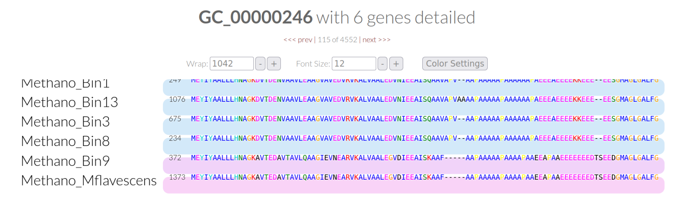

# Day 6 - Pangenomics

## Evaluation of starting databases

Accessing the interactive interface for evaluation of databases in "/Day6/02_contigs-dbs". Start server with following commands. First, run on node on HPC:

```
srun --reservation=biol217 --pty --mem=10G --nodes=1 --tasks-per-node=1 --cpus-per-task=1 /bin/bash
```
Activate conda environment:
```
conda activate /home/sunam225/miniconda3/miniconda4.9.2/usr/etc/profile.d/conda.sh/envs/anvio-7.1
```
Examine all .db files:
```
anvi-display-contigs-stats *db
```
Server data:
- node010
- port 8084

Access server with another terminal:

```
ssh -L 8060:localhost:8084 sunam237@caucluster-old.rz.uni-kiel.de
ssh -L 8080:localhost:8084 node010
```

Access interface in brother with http://127.0.0.1:8060.

Questions:

How do the MAGs compare in size and number of contigs to the full genome?

- the MAGs are shorter than the full genome
- the full genomen only consists of one contig while the contig number for the MAGs varies between 137 to 334 contigs
- the MAGs vary in sizes of their contigs also indicating quality of the MAGs

Based on the contig numbers, sizes and number of marker genes (HMM hits), which two MAGs are the best and which is the worst?

- best MAGs: `Methano_Bin13` and `Methano_Bin8`: both have the lowester numbers of contigs while also having some of the longest (164 contigs with 7 > 50 kb and even 1 > 100 kb/137 contigs with 3 > 50 kb, "average length of contigs" N50: 22,585/19343); both also have the highest number of marker genes/HMM hits (80 archaeal/76 archaeal); `Methano_Bin9` also seems reasonable considering its total length (highest total length)
- worst MAGs: `Methano_Bin10` and `Methano_Bin5`: short total lengths with the worst contig lengths (no contigs > 20 kb, N50: 4,894/4,826); lowest number of marker gene hits (42 archaeal/33 archaeal)

## Making a Pangenome

### Create an external genomes file

Generation of `external genomes file` (/02_contigs-dbs directory):

```
anvi-script-gen-genomes-file --input-dir ./ -o external-genomes.txt
```
Output:
| name      | contigs_db_path |
| ----------- | ----------- |
| Methano_Bin1      | /work_beegfs/sunam237/Day6/02_contigs-dbs/Bin1.db       |
| Methano_Bin10   | /work_beegfs/sunam237/Day6/02_contigs-dbs/Bin10.db        |
| Methano_Bin13   | /work_beegfs/sunam237/Day6/02_contigs-dbs/Bin13.db        |
| Methano_Bin3   | /work_beegfs/sunam237/Day6/02_contigs-dbs/Bin3.db        |
| Methano_Bin5   | /work_beegfs/sunam237/Day6/02_contigs-dbs/Bin5.db        |
| Methano_Bin8   | /work_beegfs/sunam237/Day6/02_contigs-dbs/Bin8.db        |
| Methano_Bin9   | /work_beegfs/sunam237/Day6/02_contigs-dbs/Bin9.db        |
| MMethano_Mflavescens   | /work_beegfs/sunam237/Day6/02_contigs-dbs/Mflavescens.db        |

This file will be provided to the following process to let it know which genomes and MAGs it should use.

### Estimate genome completeness

The genome completeness is checked to not submit a bad bin or incomplete genome to the following processes using the previously created external genomes file.

```
anvi-estimate-genome-completeness -e external-genomes.txt > genome-completeness.txt
```
Question:

How do the bins compare to isolate genomes? Would you remove one, based on the output of the completeness estimation?

- most of the bins show lower genome completeness and also have redundancies
- lower than 70% completion or higher than 10% redundancy: `Methano_Bin10` and `Methano_Bin5` should be removed (both have lower completion)

### Remove unwanted genomes

(in /02_contigs-dbs directory)

```
mkdir bin_trash
mv Bin10.db Bin5.db ./bin_trash/
```

Create final external genomes file without discarded bins:
```
anvi-script-gen-genomes-file --input-dir ./ -o external-genomes-final.txt
```

## Creating the pangenome database

Creation of genome storage database (summary of bins) and pangenome database (comparison of genome sequences, clustering/alignment of bins) in /03_pangenome directory with the following bash script.
```
#!/bin/bash

#SBATCH --nodes=1
#SBATCH --cpus-per-task=10
#SBATCH --mem=500M
#SBATCH --time=00:05:00
#SBATCH --job-name=pandatabase
#SBATCH -D ./
#SBATCH --output=./pandatabase.out
#SBATCH --error=./pandatabase.out
#SBATCH --partition=all
#SBATCH --reservation=biol217


module load miniconda3/4.7.12.1
source activate
conda activate /home/sunam225/miniconda3/miniconda4.9.2/usr/etc/profile.d/conda.sh/envs/anvio-7.1

#pandatabase

anvi-gen-genomes-storage -e ../../02_contigs-dbs/external-genomes-final.txt -o ../Methano-GENOMES.db

cd ../

anvi-pan-genome -g Methano-GENOMES.db --project-name MethanoPangenome --num-threads 10

#this prints the required resources into your logfile
jobinfo
```

## Genome similarity based on average nucleotide identity (ANI) 

Genome similarity based on ANI was calculated by submitting the following bash script (input: final external genomes text file, adding results to previously created pangenome database by naming path to -PAN.db file, use of PyANI).

```
#!/bin/bash

#SBATCH --nodes=1
#SBATCH --cpus-per-task=10
#SBATCH --mem=600M
#SBATCH --time=00:02:00
#SBATCH --job-name=similarity
#SBATCH -D ./
#SBATCH --output=./similarity.out
#SBATCH --error=./similarity.out
#SBATCH --partition=all
#SBATCH --reservation=biol217


module load miniconda3/4.7.12.1
source activate
conda activate /home/sunam225/miniconda3/miniconda4.9.2/usr/etc/profile.d/conda.sh/envs/anvio-7.1

#similarity

anvi-compute-genome-similarity --external-genomes ../../02_contigs-dbs/external-genomes-final.txt --program pyANI --output-dir ../ANI --num-threads 10 --pan-db ../MethanoPangenome/MethanoPangenome-PAN.db

#this prints the required resources into your logfile
jobinfo
```

## Visualizing the pangenome

The server for the interactive interface was started.

```
srun --pty --mem=10G --nodes=1 --tasks-per-node=1 --cpus-per-task=1 --reservation=biol217 --partition=all /bin/bash

#activate the conda environment
conda activate /home/sunam225/miniconda3/miniconda4.9.2/usr/etc/profile.d/conda.sh/envs/anvio-7.1
```
Display of Pangenome (determine port number):
```
anvi-display-pan -p ./MethanoPangenome/MethanoPangenome-PAN.db -g Methano-GENOMES.db -P 8085
```
Server data:
- node010
- port: 8085

The server was accessed in a new terminal.
```
ssh -L 8060:localhost:8085 sunam237@caucluster-old.rz.uni-kiel.de
ssh -L 8085:localhost:8085 node010
```
The interface was accessed with http://127.0.0.1:8060.

## Interpreting and ordering the pangenome (interactive interface)

### TASK: Genome similarity

Question: Based on the frequency clustering of genes, do you think all genomes are related? Why?

- not all genomes are related since only `Methano_Bin1`, `Methano_Bin13`, `Methano_Bin3` and `Methano_Bin8` as well as `Methano_Bin9` and the reference `Methano_Mflavescens` overlap (2 groups)

Question: How does the reference genome compare to its closest bin? *Tip: Consider the genome depiction and layers above.*

- the reference genome is more complete
- the overlaps with its closest bin `Methano_Bin9` are highly similar based on frequency changes and KEGG and COG assignments

Questions: What ranges are used determine a prokaryotic species? How high can you go until you see changes in ANI? What does the ANI clustering tell you about genome relatedness?

- for prokaryotic species a ANI threshold of 95% is used
- no changes for ANI are visible until a 98% threshold
- ANI also shows that `Methano_Bin1`, `Methano_Bin13`, `Methano_Bin3` and `Methano_Bin8` are related (`Methano_Bin1` seems to be the least related to the other ones of this group), and that `Methano_Bin9` and the reference `Methano_Mflavescens` are related

### TASK: Functional profiling

Question: How are Methanogenesis genes distributed across the genome?

- the methanogenesis genes are relatively evenly distributed across the genome


### TASK: Functional/geometric homogeneity and their uses

Gene selected: `GC_00000246`

Question: What observations can you make regarding the geometric homogeneity between all genomes and the functional homogeneity?

- high functional similarity (searched for) does not necessarily reflect high geometric homogeneity: in `GC_00000246` various differences between the two previoulsy mentioned groups in amino acid substitution and gaps are visible; there is also a minor difference in geometry between `Methano_Bin13` and its group members (has alanines instead of gap)



## BONUS: BlastKoala

[These](https://www.kegg.jp/kegg-bin/blastkoala_result?id=5167323e7144fba776bf171bbf8afe664095205a&passwd=IdCWWe&type=blastkoala) results from a BlastKoala job were analyzed.

Questions: Can the organism do methanogenesis? Does it have genes similar to a bacterial secretion system?

- the organism seems to have the ability to do methanogenesis (90 entries for methane metabolism)
- the organism does have genese similar to a bacterial secretion system (7 entries for bacterial secretion system) 