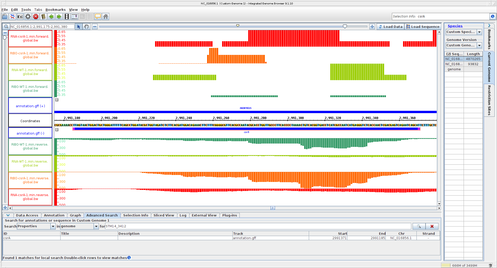
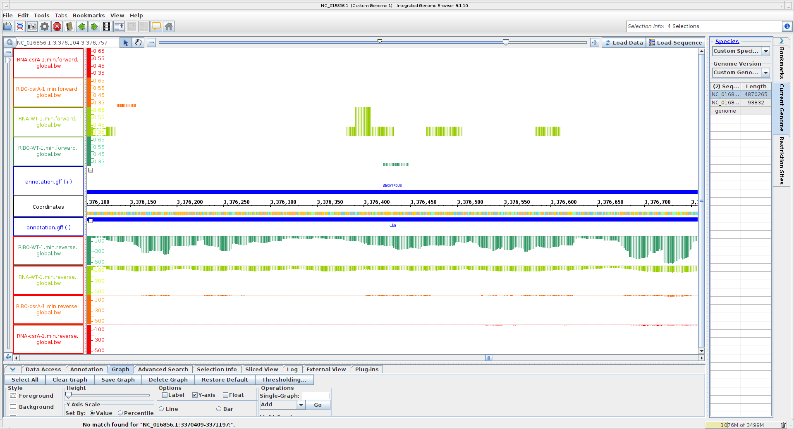
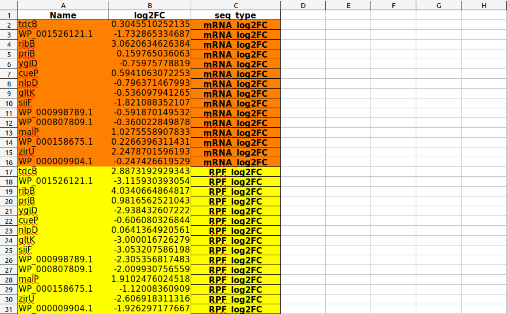
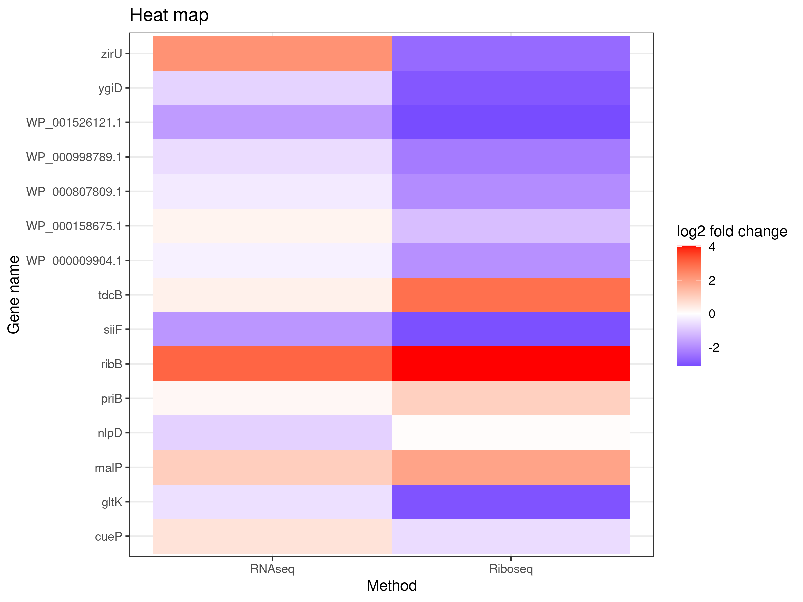
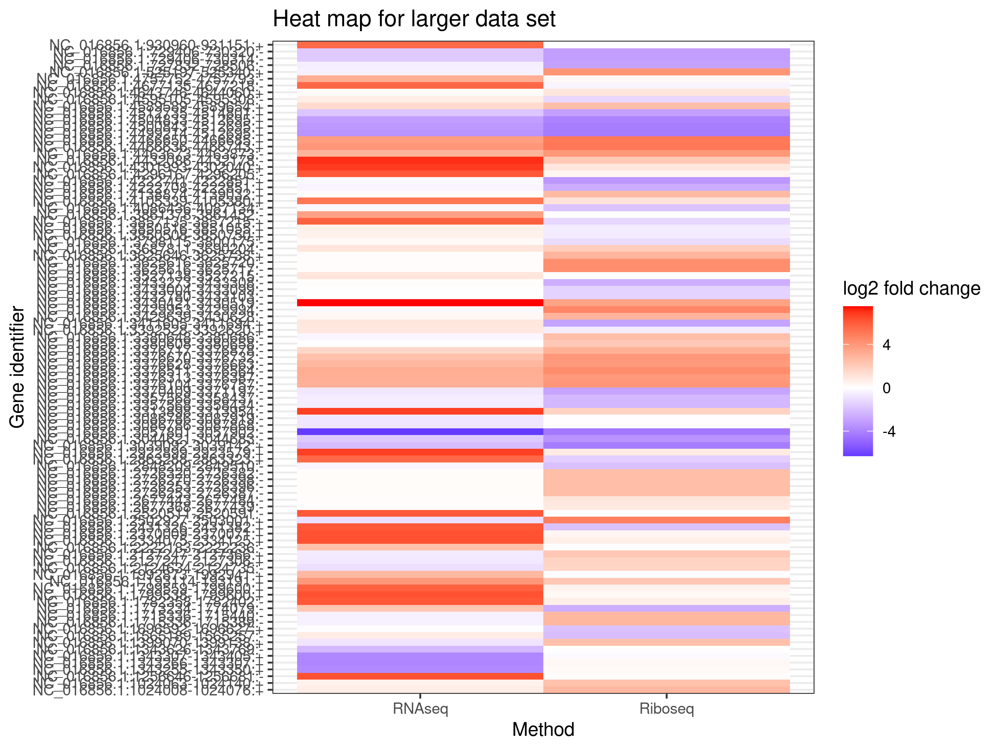
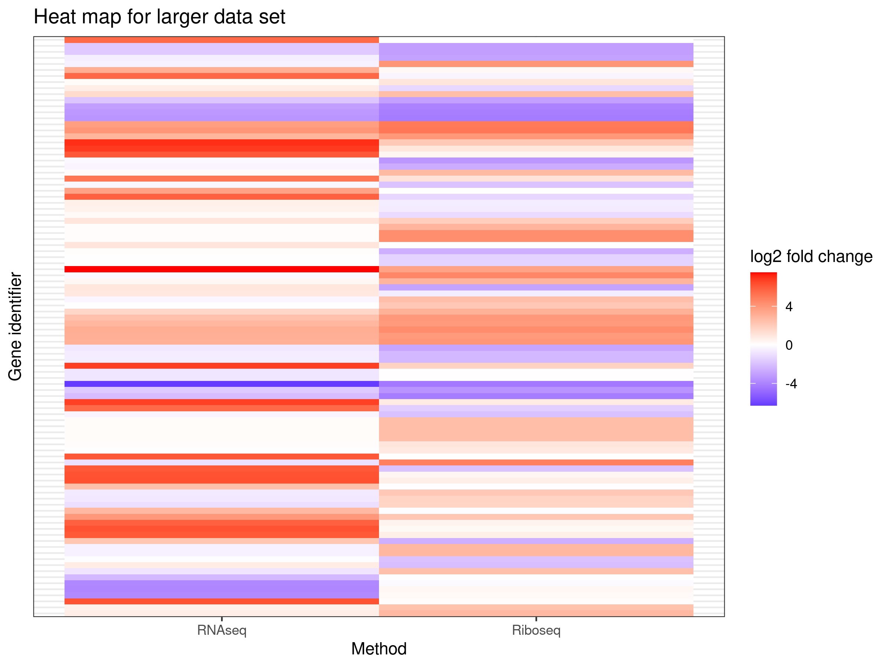

# Day 9

## RNAseq and Riboseq

### Continuation of READemption installation

In reademption environment the following commands were executed.
```
conda install -c bioconda bioconductor-deseq2 -y
conda install -c bioconda segemehl -y
conda install -c r r-gplots -y
```

After confirmation of package installation the bash script from Day 8 was submitted again with own reademption environment.

## IGB

Dataset from Google Drive

Load genome (.fa) and annotation file (.gff)

Search for csrA (start: 2991371; end 2991185)

Load all coverage files (.bw), adjust colors and position based on conditions and forward/reverse (top or bottom of viewer)

Comparison of wt and *csrA* mutant in same condition 

----



Questions (locus tag STM14_3412, csrA):

Start codon?

- ATG

Stop codon?

- TAA

Length in amino acids?

- 186/3 - 1 = 61 (substract stop codon)

Shine-Dalgarno sequence (consensus AGGAGG at -7 to -4)?

- AGGAG at -7

Name of upstream gene?

- alaS (locus tag: STM14_3413)

Is csrA translated? Why?

- Yes because ribosome coverage covers whole wt gene (starts at start codon and ends at stop codon approximately).

---
Search for genes with padj < 0.05 in csrA-WT_sorted.xlsx (riborex directory).

- e.g. tdcB (NC_016856.1:3429639-3430628), looks also significant in IGB
- e.g. ygiD (NC_016856.1:3370409-3371197), looks also significant in IGB
- e.g. ribB (NC_016856.1:3376104-3376757), significant in IGB (see image)



----

## Heatmap creation

From the RNAseq and Riboseq data (/xtail directory), sheets structured like the following were created and copied to the R project folder created the previous day.



The following R script wass created for the first heat map plot (using ggplot2):

```
# Import data ----

library(readxl)
df <- read_excel("csrA-WT_sorted.xlsx", 
                             sheet = "Sheet4")
View(df)

# Graph

library(ggplot2)

ggplot(df, aes(seq_type, Name, fill = log2FC)) + geom_tile() +
  scale_fill_gradient2(low = "blue",
                       mid = "white",
                       high = "red", name = "log2 fold change") + theme_bw() +
  labs(y = 'Gene name', x = 'Sequence type', title = 'Heat map') +
  scale_x_discrete(labels= c("RNAseq", "Riboseq"))

ggsave('heat_map1.png', height = 6, width = 8, unit = 'in', dpi = 300)

  ```



  A larger amount of data was prepared as before and a heat map with similar code was created with the following R script.
  ```
  # Import larger data set ----

library(readxl)
df2 <- read_excel("csrA-WT_sorted.xlsx", 
                  sheet = "Sheet5")
View(df2)

# Graph for larger data set

library(ggplot2)

ggplot(df2, aes(seq_type, Identifier, fill = log2FC)) + geom_tile() +
  scale_fill_gradient2(low = "blue",
                       mid = "white",
                       high = "red", name = "log2 fold change") + theme_bw() +
  labs(y = 'Gene identifier', x = 'Sequence type', title = 'Heat map for larger data set') +
  scale_x_discrete(labels= c("RNAseq", "Riboseq"))

ggsave('heat_map2.png', height = 6, width = 8, unit = 'in', dpi = 300)
```



For same heat map without y-axis labels and ticks, add the following:
```
+ theme(axis.text.y=element_blank(), axis.ticks.y=element_blank())
```

