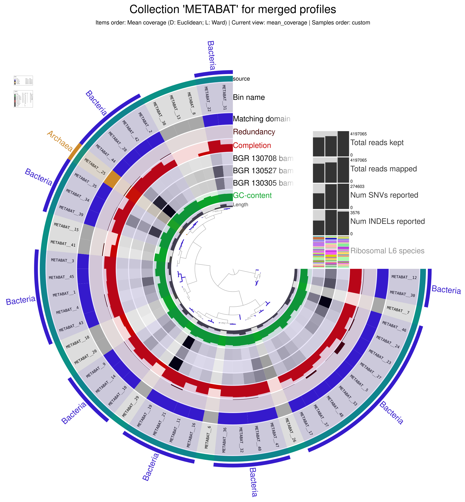
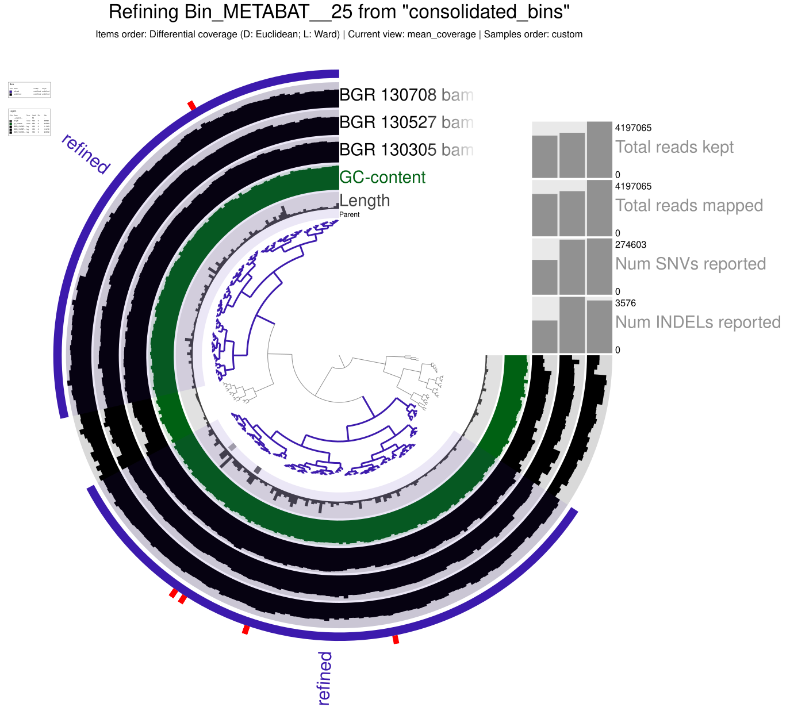

# Day 1 - Introduction to Linux

## Basic commands
Basic commands in the Linux command line tool were internalized.

Examples:
- navigating to a path/in a folder/accessing files:
```
cd /PATH     # navigating to absolute path
cd ./XXX    # navigating to a folder/accessing a file in the current folder
cd ../      # accessing the previous folder at the current PATH  
```
- creating new folders/files:
```
mkdir FOLDER            # creating a folder at current PATH
touch FILE.EXTENSION    # creating a file at current PATH 
```
- copying/moving folders/files:
```
cp /ORIGINPATH/FILE.EXTENSION /TARGETPATH/  # copying a file
cp /ORIGINPATH/*.EXTENSION /TARGETPATH/     # copying all files with the given extension (without extension: all files)
cp -r /ORIGINPATH/FOLDER /TARGETPATH/       # copying a folder
mv ...                                      # moving a folder/a file/files, everyting similar to commands above
```

## How does a bash script work?

### Head
```
#!/bin/bash
#SBATCH --nodes=1
#SBATCH --cpus-per-task=4
#SBATCH --mem=10G
#SBATCH --time=1:00:00
#SBATCH --job-name=JOBNAME
#SBATCH --output=OUTPUTFILE.out
#SBATCH --error=ERRORFILE.err
#SBATCH --partition=all
#SBATCH --reservation=biol217
```

The head determines general settings including, for example, the numbers of CPUs used, amount of memory used, maximum job time, the job name, and ouput paths for the output and error files (can also be one path/merged into one file).

### Main

The main part of the bash script determines the actual job done by the script.

```
module load miniconda3/4.7.12.1
conda activate /home/sunam226/.conda/envs/anvio

#JOB
 
JOB SCRIPT

jobinfo
```

Generally we started by loaded the appropriate conda environment (environment that included every tool for the purpose at the time). After that the command for the actual job is written followed by `jobinfo`, which prints the required resources into the logfile for the job.

### Usage on caucluster

Ready bash scripts were send from the login-node to the server (caucluster) by the following command.
```
sbatch JOB.sh
```
Submitted jobs get a JOB_ID on the server.


The progress could be followed by the following command (every job in process for this account on the server).
```
squeue -u sunam237
```
To follow the detailed progress, the OUTPUT or ERROR files could be tailed in the command tool.
```
tail -n 50 -f FILENAME.EXTENSION
```
To cancel a job, the following command was used.
```
scancel JOBID
```

# Day 2 - Metagenomics

The sample data folder including the raw reads used for the metagenomics analysis were copied to the own $WORK folder in the login-node (raw files from sequencing: .fastp.gz; .gz is compression).

## Quality control using fastqc

The raw reads were evaluated and assigned the `phred quality score` to determine how accurate the raw reads were (phred quality score > 20 is sufficient in this case).

A bash script with the following command was submitted.

```
module load fastqc
cd /work_beegfs/sunam237/metagenomics/0_raw_reads/
for i in *.gz; do fastqc $i; done
```

This creates .html files as output, which provide information about the quality of the sequences by the phred quality score. The graphs from the analysis were analyzed.
- none of the samples consisted of sequences with poor quality that needed trimming

Nevertheless, we continued to learn to trim the samples using the tool fastp.

## Trimming of raw reads using fastp

The tool fastp trims the raw reads based on the individual phred quality scores and the given threshold. The following commands were submitted in a bash script.

```
module load fastp
cd /work_beegfs/sunam237/metagenomics/0_raw_reads/
mkdir ../output_folder

for i in `ls *_R1.fastq.gz`;
do
    second=`echo ${i} | sed 's/_R1/_R2/g'`
    fastp -i ${i} -I ${second} -R _report -o ../output_folder/"${i}" -O ../output_folder/"${second}" -t 6 -q 20

done
```

This creates new .fastq.gz files with the trimmed/cleaned reads ready for assembly in the next step.

## Assembly using megahit

Genome assemblies were performed with the processed reads.

The following commands were submitted in a bash script (megahit does create its own output folder).
```
cd /work_beegfs/sunam237/metagenomics/output_folder
                                       
megahit -1 BGR_130305_R1.fastq.gz -1 BGR_130527_R1.fastq.gz -1 BGR_130708_R1.fastq.gz -2 BGR_130305_R2.fastq.gz -2 BGR_130527_R2.fastq.gz -2 BGR_130708_R2.fastq.gz --min-contig-len 1000 --presets meta-large -m 0.85 -o ../coassembly_output"$i" -t 20                      

jobinfo
```

Per sample, a output fasta file (.fa) is created containing the associated assemblies/contigs. These sequences still cannot be associated with a larger context and their origin cannot be determined. The contigs were visualized on the next day.

# Day 3 - Metagenomics

## Assembly Visualization

The number of contigs assembled using megahit yesterday could be determined by the following command.
```
grep -c ">" final.contigs.fa
```
- 57414 contigs

For visualization of the contigs in Bandage, file format conversion is necessary (from fasta .fa files to .fastg files).
```
megahit_toolkit contig2fastg 99 final.contigs.fa > final.contigs.fastg                   
```

This makes visualization using Bandage possible.
Figure of view in Bandage:


Observations:
- contigs are represented in different colors
- from top to bottom the assembled contigs are arranged from the largest to smallest contigs
- contigs are represented with different shapes/curvatures and sometimes loops 


## Assembly Quality Assessment

The quality of the assemblies shown above was assessed by using the tool metaquast. The following command was submitted via a bash script.
```                                    
metaquast -t 6 -o /work_beegfs/sunam237/Day3/3_metaquast -m 500 /work_beegfs/sunam237/Day3/3_coassembly/final.contigs.fa
```
The output parameters for quality of the assemblies are printed into an .html file. The file was inspected.

Questions:

What is your N50 value? Why is this value relevant?

- N50 value: 2963
- relevance: length of contigs, where equal or longer lengths account for 50% of the bases of the assembly, higher values should indicate better quality of the assembly

How many contigs are assembled

- 57.414

What is the total length of the contigs?

- 145.675.865

## Genome Binning

Genome binning was conducted to finally make sense of the previously created assemblies and associate them with the genomes of organisms.

### Preparation

To be able to use Anvi'o later, first, the fasta sequence (contigs) IDs need to be reformatted. For this, the following command was submitted in a bash script.
```                      
anvi-script-reformat-fasta /work_beegfs/sunam237/Day3/3_coassembly/final.contigs.fa -o /work_beegfs/sunam237/Day3/4_mapping/contigs.anvio.fa --min-len 1000 --simplify-names --report-file name_conversion.txt
```

The output file "contigs.anvi.fa" could now be used for mapping by bowtie2 in the next step (for contig coverage).

### Mapping

The raw reads were now mapped onto the previously created contigs/assemblies to get the contig coverage. For this, the tool bowtie2 was used. First, to index the mapping reference fasta file and make mapping faster, the following command was submitted via a bash script (the paths for `reference_in` and `bt2_index_base` should be in the same folder).
```                           
bowtie2-build /work_beegfs/sunam237/Day3/4_mapping/contigs.anvio.fa /work_beegfs/sunam237/Day3/4_mapping/contigs.anvio.fa.index
```

The output index file "contigs.anvio.fa.index" together with the clean reads (fastp) were used for the actual mapping using bowtie2. The following commands were submitted in a bash script. While this was done with individual commands for each sample, the (commented) `for loop` should have also worked (no full patch should be between "`", use cd to navigate to corresponding path before instead).
```
bowtie2 --very-fast -x /work_beegfs/sunam237/Day3/4_mapping/contigs.anvio.fa.index -1 /work_beegfs/sunam237/Day3/2_fastp/BGR_130305_mapped_R1.fastq.gz -2 /work_beegfs/sunam237/Day3/2_fastp/BGR_130305_mapped_R2.fastq.gz -S /work_beegfs/sunam237/Day3/4_mapping/BGR_130305_sample.sam
bowtie2 --very-fast -x /work_beegfs/sunam237/Day3/4_mapping/contigs.anvio.fa.index -1 /work_beegfs/sunam237/Day3/2_fastp/BGR_130527_mapped_R1.fastq.gz -2 /work_beegfs/sunam237/Day3/2_fastp/BGR_130527_mapped_R2.fastq.gz -S /work_beegfs/sunam237/Day3/4_mapping/BGR_130527_sample.sam
bowtie2 --very-fast -x /work_beegfs/sunam237/Day3/4_mapping/contigs.anvio.fa.index -1 /work_beegfs/sunam237/Day3/2_fastp/BGR_130708_mapped_R1.fastq.gz -2 /work_beegfs/sunam237/Day3/2_fastp/BGR_130708_mapped_R2.fastq.gz -S /work_beegfs/sunam237/Day3/4_mapping/BGR_130708_sample.sam

#cd /work_beegfs/sunam237/Day3/2_fastp/
#for i in `ls *mapped_R1.fastq.gz`;
#do
#    second=`echo ${i} | sed 's/_R1/_R2/g'`
#    bowtie2 --very-fast -x /work_beegfs/sunam237/Day3/4_mapping/contigs.anvio.fa.index -1 ${i} -2 ${second} -S /work_beegfs/sunam237/Day3/4_mapping/"$i".sam 
#done
```
The output .sam files (sequence mapping files) need to be converted into .bam files (binary alignment and map files) for later steps. For this, the tool samtools was used. The following commands were submitted via a bash script.
```
module load samtools

cd /work_beegfs/sunam237/Day3/4_mapping/
for i in *.sam; do samtools view -bS $i > "$i".bam; done
```

# Day 4 - Metagenomics

## Anvi'o self-test

Anvi'o was initiated/tested via the following commands.
```
anvi-cluster-contigs -h
```
```
anvi-self-test --suite mini
```

## Genome Binning - Continuation
### Contigs data preparation

Using Anvi'o, a contig database was created for our contig sequences. This will compute k-mer frequencies for each contig, split contigs longer than 20 kb into smaller ones and identify open reading frames using Prodigal. For this, the follwing command was submitted via a bash script.
```
anvi-gen-contigs-database -f /work_beegfs/sunam237/Day3/4_mapping/contigs.anvio.fa -o ../contigs.db -n 'biol217'
```

The output .db file was used for a HMM (Hidden Markov Models) search (search for specific genes with known functions in a larger dataset). For that, the following command was submitted via a bash script.
```
anvi-run-hmms -c ../contigs.db -T 12
```
The results created by the previous commands (created database) can be investigate by an Anvi'o interactive contigs stats interface. To do this, first, the following command was executed in a caucluster terminal (access node on caucluster).
```
srun --reservation=biol217 --pty --mem=10G --nodes=1 --tasks-per-node=1 --cpus-per-task=1 --partition=all /bin/bash
```
This provided the following node information.
- node010

In the same terminal the following commands were executed (in folder with database file).
```
conda activate /home/sunam225/miniconda3/miniconda4.9.2/usr/etc/profile.d/conda.sh/envs/anvio-7.1
```
```
anvi-display-contigs-stats contigs.db
```

This started a server with the port 8084.

In a new terminal (not logged in into caucluster) the server was accessed with the following commands.
```
ssh -L 8060:localhost:8084 sunam237@caucluster-old.rz.uni-kiel.de
```
```
ssh -L 8084:localhost:8084 node010
```

The interactive interface of the stats was accessed in Firefox via the link http://127.0.0.1:8060.

### Binning with Anvi'o

From now on, the Anvi'o platform was used.

First, the previously created .bam files were sorted and indexed (merging .bam and .bam.bai files). Anvi'o uses samtools for this. The following commands were submitted via a bash script.
```
cd /work_beegfs/sunam237/Day3/4_mapping/

for i in *.bam; do anvi-init-bam $i -o /work_beegfs/sunam237/Day3/5_anvio-profiles/"$i".sorted.bam; done
```

Now, binning with Anvi'o can be performed. For this, an Anvi'o Profile is created. This will process each contig (longer than 2500 nucleotides by default). The following commands were submitted via a bash script.

```
cd /work_beegfs/sunam237/Day3/5_anvio-profiles/

mkdir /work_beegfs/sunam237/Day3/5_anvio-profiles/profiling/

for i in `ls *.sorted.bam | cut -d "." -f 1`; do anvi-profile -i "$i".bam.sorted.bam -c contigs.db -o /work_beegfs/sunam237/Day3/5_anvio-profiles/profiling/$i -T 12; done
```

Since this provides output files for each of our three samples, the output files were merged into one file by submitting the following command via a bash script.
```
anvi-merge /work_beegfs/sunam237/Day3/5_anvio-profiles/profiling/BGR_130305/PROFILE.db /work_beegfs/sunam237/Day3/5_anvio-profiles/profiling/BGR_130527/PROFILE.db /work_beegfs/sunam237/Day3/5_anvio-profiles/profiling/BGR_130708/PROFILE.db -o /work_beegfs/sunam237/Day3/5_anvio-profiles/merged_profiles -c /work_beegfs/sunam237/Day3/5_anvio-profiles/contigs.db --enforce-hierarchical-clustering
```

Now, binning was performed using two different binners - Metabat2 and CONCOCT - and, finally, DAS_Tool was used to choose the best bins.

Binning with Metabat2 was performed by submitting the following commands in a bash script.
```
anvi-cluster-contigs -p /work_beegfs/sunam237/Day3/5_anvio-profiles/merged_profiles/PROFILE.db -c /work_beegfs/sunam237/Day3/5_anvio-profiles/contigs.db -C METABAT --driver metabat2 -T 12 --just-do-it --log-file log-metabat2

anvi-summarize -p /work_beegfs/sunam237/Day3/5_anvio-profiles/merged_profiles/PROFILE.db -c /work_beegfs/sunam237/Day3/5_anvio-profiles/contigs.db -o /work_beegfs/sunam237/Day3/5_anvio-profiles/SUMMARY_METABAT -C METABAT

```
Binning with CONCORD was performed by submitting the following commands in a bash script.
```
anvi-cluster-contigs -p /work_beegfs/sunam237/Day3/5_anvio-profiles/merged_profiles/PROFILE.db -c /work_beegfs/sunam237/Day3/5_anvio-profiles/contigs.db -C CONCOCT --driver concoct -T 12 --just-do-it

anvi-summarize -p /work_beegfs/sunam237/Day3/5_anvio-profiles/merged_profiles/PROFILE.db -c /work_beegfs/sunam237/Day3/5_anvio-profiles/contigs.db -o /work_beegfs/sunam237/Day3/5_anvio-profiles/SUMMARY_CONCOCT -C CONCOCT
```
Binning consolidation by DAS_Tool was performed by submitting the following commands in a bash script.
```
anvi-cluster-contigs -p work_beegfs/sunam237/Day3/5_anvio-profiles/merged_profiles/PROFILE.db -c //work_beegfs/sunam237/Day3/5_anvio-profiles/contigs.db -C consolidated_bins --driver dastool -T 20 --search-engine diamond -S METABAT,CONCOCT --log-file log_consolidation_of_bins --just-do-it

anvi-summarize -p work_beegfs/sunam237/Day3/5_anvio-profiles/merged_profiles/PROFILE.db -c /work_beegfs/sunam237/Day3/5_anvio-profiles/contigs.db -o /work_beegfs/sunam237/Day3/5_anvio-profiles/SUMMARY_consolidated_bins -C consolidated_bins
```
Unfortunately, due to the occurence of Python errors, the output .html files shwoing the results had to be copied and were then evaluated to answer the following questions.

Questions:

Number of ARCHAEA bins you got from MetaBAT2?
- 3
  
Number of ARCHAEA bins you got from CONCOCT?
- 2

Number of ARCHAEA bins you got after consolidating the bins?
- 2

# Day 5 - Metagenomics

## MAGs Quality Assessment

The generated MAGs were assessed regarding their quality. First, the generated collections were checked by executing the following command on the login node.
```
anvi-estimate-genome-completeness -p /home/sunam226/Day3/5_anvio-profiles/merged_profiles/PROFILE.db -c /work_beegfs/sunam237/Day3/4_mapping/contigs.db --list-collections
```
Due to the errors on the previous day, only a collection for Metabat2 could be found. The results were visualized using the Anvi'o interactive interface.

 In a terminal (caucluster) the following commands were executed (in "/merged_profiles" directory).
```
srun --reservation=biol217 --pty --mem=10G --nodes=1 --tasks-per-node=1 --cpus-per-task=1 --partition=all /bin/bash
```
- node010
  
```
conda activate /home/sunam225/miniconda3/miniconda4.9.2/usr/etc/profile.d/conda.sh/envs/anvio-7.1
```
```
anvi-interactive -p /work_beegfs/sunam237/Day3/5_anvio-profiles/merged_profiles/PROFILE.db -c contigs.db -C METABAT
```
- port: 8087

In a new terminal (not on caucluster) the following commands were executed to access the server for the interactive interface for MAGs quality assessment.
```
ssh -L 8060:localhost:8087 sunam237@caucluster-old.rz.uni-kiel.de
ssh -L 8087:localhost:8087 node010
```

The interactive interface was accessed in Firefox with the address http://127.0.0.1:8060.

The result for the Metabat2 collection can be seen in the following (archaeal/bacterial bins are marked in orange/blue).



Now the complete data was used for further steps. For estimation of genome completeness (using consolidated bins) and save the results as a .txt file, the following command was executed.
```
anvi-estimate-genome-completeness -c /work_beegfs/sunam237/Day5/contigs.db -p PROFILE.db -C consolidated_bins > genome_completeness_dastool.txt
```

Questions for validation of MAGs quality assessment:

Which binning strategy gives you the best quality for the ARCHAEA bins?

- Metabat2 provided the best results

How many ARCHAEA bins do you get that are of High Quality? How many BACTERIA bins do you get that are of High Quality?

- 2 ARCHAEA of high quality
- 30 BACTERIA of high quality

> High quality: >90% completion, <5% contamination

## Bin Refinement

Now, the previously assessed bins were refined (focus on archaeal bins).

### Preparation

First, our previously created collections were summarized (overview of collections with its statisctics calculated by Anvi'o) and fasta files of our bins (needed for further analysis) were created by the submitting the following command in a bash script.
```
anvi-summarize -c /work_beegfs/sunam237/Day5/contigs.db -p /work_beegfs/sunam237/Day5/5_anvio_profiles/merged_profiles/PROFILE.db -C consolidated_bins -o /work_beegfs/sunam237/Day5/5_anvio_profiles/SUMMARY_consolidated_bins_own --just-do-it
```

The fasta files of the previously identified archaeal MAGs "`Bin_Bin_1`" and "`Bin_METABAT__25`" were copied from the created SUMMARY folder to a new folder "ARCHAE_BIN_REFINEMENT".

### Chimera Detection in MAGs

The tool GUNC was used to detect chimeras in the archaeal MAGs "`Bin_Bin_1`" and "`Bin_METABAT__25`". For this, the following commands were submitted in a bash script.

```
conda activate /home/sunam226/.conda/envs/gunc

cd ../ARCHAEA_BIN_REFINEMENT

mkdir GUNC

for i in *.fa; do gunc run -i "$i" -r /home/sunam226/Databases/gunc_db_progenomes2.1.dmnd --out_dir GUNC --threads 10 --detailed_output; done
```

The results were evaluated.

Questions:

Do you get ARCHAEA bins that are chimeric? (hint: look at the CSS score (explained in the lecture) and the column PASS GUNC in the tables outputs per bin in your gunc_output folder)

- Yes, the bin "`Bin_Bin_1`" is `chimeric`. The bin "`Bin_METABAT__25`" is `not chimeric`.

In your own words (2 sentences max), explain what is a chimeric bin.

- In a chimeric bin, contigs from different species were mistakenly assembled into the same genomic bin. It, therefore, is a false genome and does not represent one actual species.

> A low CSS (close to 0) means within contigs, there could not be made (or only a few) different assignments of taxa (so it is most likely only from the same taxa): The bin is probably not chimeric regarding the associated taxonomic level.

### Manual Refinement

The bin "`Bin_METABAT__25`" is not chimeric and was, therefore, chosen for further processing (manual refinement). Manual refinement was done in the Anvi'o interactive interface, which was initiated by the following commands (on caucluster).

```
srun --reservation=biol217 --pty --mem=10G --nodes=1 --tasks-per-node=1 --cpus-per-task=1 /bin/bash
```
- node002
```
conda activate /home/sunam225/miniconda3/miniconda4.9.2/usr/etc/profile.d/conda.sh/envs/anvio-7.1
```
```
anvi-refine -c ../contigs.db -C consolidated_bins -p ./merged_profiles/PROFILE.db --bin-id Bin_METABAT__25
```
- port: 8081

In a new terminal (not caucluster), a connection was established by using the following commands.
```
ssh -L 8060:localhost:8081 sunam237@caucluster-old.rz.uni-kiel.de
ssh -L 8081:localhost:8081 node002
```
The interactive interface was accessed in Firefox with the address "http://127.0.0.1:8060".

Manual refinement was conducted.

Questions:

Does the quality of your ARCHAEA improve?

- completeness/redundancy (before): 97.37%/5.26%
- completeness/redundancy (after): 93.42%/5.26%
- the quality did not improve but, based on coverage, obvious outlier regions were removed (refined bin is marked in purple)



- validation of the sequence composition suggested that the bin probably inhibits two strains of the same species

How abundant are the ARCHAEA bins in the 3 samples? (relative abundance)

- BGR_130305: 1.76
- BGR_130527: 1.14
- BGR_130708: 0.58

## Taxonomic Assignment

Taxonomic annotations were assigned to the created bins. First, single-copy core genes in our previously created contigs database were associated with taxonomy information by submitting the following command in a bash script.
```
anvi-run-scg-taxonomy -c ../../contigs.db -T 20 -P 2
```

Then, taxonomy estimated for the bins stored in the database were made using single-copy core genes were made by submitting the following command in a bash script.
```
anvi-estimate-scg-taxonomy -c ../../contigs.db --metagenome-mode
```

With this, taxonomy assignment was complete. The `anvi-summarize` command from before (morning) was executed again (with another output folder). In the output (`bins_summary.txt`) the changes from the previous refinement were observable.

Questions:

Did you get a species assignment to the ARCHAEA bins previously identified?

- Yes, the species for the non-discarded bin ("`Bin_METABAT__25`") is *Methanoculleus* sp012797575; for the discarded bin ("`Bin_Bin_1`"), the species is *Methanosarcina flavescens*.

Does the HIGH-QUALITY assignment of the bin need revision? (hint: MIMAG quality tiers)

- Yes, it probably needs revision after further refinement of the bins.