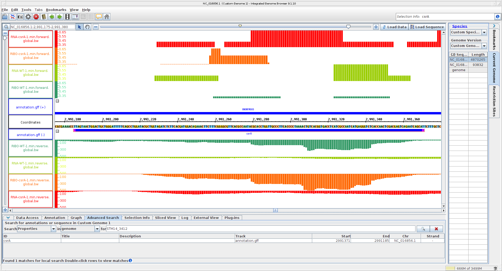
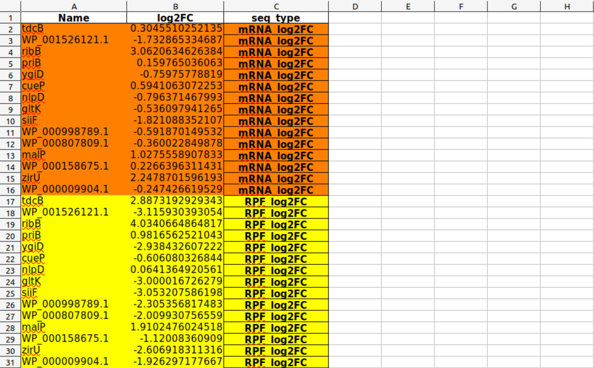

# Day 1 - Introduction to Linux

## Basic commands
Basic commands in the Linux command line tool were internalized.

Examples:
- navigating to a path/in a folder/accessing files:
```
cd /PATH     # navigating to absolute path
cd ./XXX    # navigating to a folder/accessing a file in the current folder
cd ../      # accessing the previous folder at the current PATH  
```
- creating new folders/files:
```
mkdir FOLDER            # creating a folder at current PATH
touch FILE.EXTENSION    # creating a file at current PATH 
```
- copying/moving folders/files:
```
cp /ORIGINPATH/FILE.EXTENSION /TARGETPATH/  # copying a file
cp /ORIGINPATH/*.EXTENSION /TARGETPATH/     # copying all files with the given extension (without extension: all files)
cp -r /ORIGINPATH/FOLDER /TARGETPATH/       # copying a folder
mv ...                                      # moving a folder/a file/files, everyting similar to commands above
```

## How does a bash script work?

### Head
```
#!/bin/bash
#SBATCH --nodes=1
#SBATCH --cpus-per-task=4
#SBATCH --mem=10G
#SBATCH --time=1:00:00
#SBATCH --job-name=JOBNAME
#SBATCH --output=OUTPUTFILE.out
#SBATCH --error=ERRORFILE.err
#SBATCH --partition=all
#SBATCH --reservation=biol217
```

The head determines general settings including, for example, the numbers of CPUs used, amount of memory used, maximum job time, the job name, and ouput paths for the output and error files (can also be one path/merged into one file).

### Main

The main part of the bash script determines the actual job done by the script.

```
module load miniconda3/4.7.12.1
conda activate /home/sunam226/.conda/envs/anvio

#JOB
 
JOB SCRIPT

jobinfo
```

Generally, firts, the appropriate conda environment is loaded (environment that included every tool for the purpose at the time). After that, the command for the actual job is provided (JOB SCRIPT) followed by "jobinfo", which prints the required resources into the logfile for the job.

### Usage on caucluster

Ready bash scripts were send from the login-node to the server (caucluster) by the following command.
```
sbatch JOB.sh
```
Submitted jobs get a JOB_ID on the server.


The progress could be followed by the following command (every job in process for this account on the server).
```
squeue -u sunam237
```
To follow the detailed progress, the OUTPUT or ERROR files could be tailed in the command tool.
```
tail -n 50 -f FILENAME.EXTENSION
```
To cancel a job, the following command was used.
```
scancel JOBID
```

# Day 2 - Metagenomics

## Workflow
 Generally, the workflow for metagenomics consists out of the following steps.
 - Pre-processing the raw reads (trimming adapters, removing chimeras, removing phiX174 virus sequences…)
 - Assemble reads into contigs/fasta
 - Asses quality of assemblies
 - Bin contigs into MAGs
 - Asses completeness, contamination, and strain heterogeneity of your MAGs
 
 ## Data

The samples in the used dataset originated from one mesophilic agricultural biogas plant located near Cologne, Germany, sampled in more or less monthly intervals over a period of 587 days ([Paper](https://sfamjournals.onlinelibrary.wiley.com/doi/full/10.1111/1751-7915.13313)). Three samples from the data in this paper were used in the following metagenomic analysis.

The sample data folder including the raw reads of the three samples was copied to the own $WORK folder in the login-node (raw files from sequencing: .fastp.gz; .gz is compression). 

## Quality control using fastqc

The raw reads were evaluated and assigned the `phred quality score` to determine how accurate the raw reads were (phred quality score > 20 is sufficient in this case).

A bash script with the following command was submitted.

```
module load fastqc
cd /work_beegfs/sunam237/metagenomics/0_raw_reads/
for i in *.gz; do fastqc $i; done
```

This creates .html files as output, which provide information about the quality of the sequences by the phred quality score. The graphs from the analysis were analyzed.
- none of the samples consisted of sequences with poor quality that needed trimming

Nevertheless, we continued to learn to trim the samples using the tool fastp.

## Trimming of raw reads using fastp

The tool fastp trims the raw reads based on the individual phred quality scores and the given threshold. The following commands were submitted in a bash script.

```
module load fastp
cd /work_beegfs/sunam237/metagenomics/0_raw_reads/
mkdir ../output_folder

for i in `ls *_R1.fastq.gz`;
do
    second=`echo ${i} | sed 's/_R1/_R2/g'`
    fastp -i ${i} -I ${second} -R _report -o ../output_folder/"${i}" -O ../output_folder/"${second}" -t 6 -q 20

done
```

This creates new .fastq.gz files with the trimmed/cleaned reads ready for assembly in the next step.

## Assembly using megahit

Genome assemblies were performed with the processed reads.

The following commands were submitted in a bash script (megahit does create its own output folder).
```
cd /work_beegfs/sunam237/metagenomics/output_folder
                                       
megahit -1 BGR_130305_R1.fastq.gz -1 BGR_130527_R1.fastq.gz -1 BGR_130708_R1.fastq.gz -2 BGR_130305_R2.fastq.gz -2 BGR_130527_R2.fastq.gz -2 BGR_130708_R2.fastq.gz --min-contig-len 1000 --presets meta-large -m 0.85 -o ../coassembly_output"$i" -t 20                      

jobinfo
```

Per sample, an output fasta file (.fa) is created containing the associated assemblies/contigs. These sequences still cannot be associated with a larger context and their origin cannot be determined. The contigs were visualized on the next day.

# Day 3 - Metagenomics

## Assembly Visualization

The number of contigs assembled using megahit yesterday could be determined by the following command.
```
grep -c ">" final.contigs.fa
```
- 57414 contigs

For visualization of the contigs in Bandage, file format conversion is necessary (from fasta .fa files to .fastg files).
```
megahit_toolkit contig2fastg 99 final.contigs.fa > final.contigs.fastg                   
```

This makes visualization using Bandage possible.
Figure of view in Bandage:


Observations:
- contigs are represented in different colors
- from top to bottom the assembled contigs are arranged from the largest to smallest contigs
- contigs are represented with different shapes/curvatures and sometimes loops 


## Assembly Quality Assessment

The quality of the assemblies shown above was assessed by using the tool metaquast. The following command was submitted in a bash script.
```                                    
metaquast -t 6 -o /work_beegfs/sunam237/Day3/3_metaquast -m 500 /work_beegfs/sunam237/Day3/3_coassembly/final.contigs.fa
```
The output parameters for quality of the assemblies are printed into an .html file. The file was inspected.

Questions:

What is your N50 value? Why is this value relevant?

- N50 value: 2963
- relevance: length of contigs, where equal or longer lengths account for 50% of the bases of the assembly, higher values should indicate better quality of the assembly

How many contigs are assembled

- 57.414

What is the total length of the contigs?

- 145.675.865

## Genome Binning

Genome binning was conducted to finally make sense of the previously created assemblies and associate them with the genomes of organisms.

### Preparation

To be able to use Anvi'o later, first, the fasta sequence (contigs) IDs need to be reformatted. For this, the following command was submitted in a bash script.
```                      
anvi-script-reformat-fasta /work_beegfs/sunam237/Day3/3_coassembly/final.contigs.fa -o /work_beegfs/sunam237/Day3/4_mapping/contigs.anvio.fa --min-len 1000 --simplify-names --report-file name_conversion.txt
```

The output file "contigs.anvi.fa" could now be used for mapping by bowtie2 in the next step (for contig coverage).

### Mapping

The raw reads were now mapped onto the previously created contigs/assemblies to get the contig coverage. For this, the tool bowtie2 was used. First, to index the mapping reference fasta file and make mapping faster, the following command was submitted in a bash script (the paths for `reference_in` and `bt2_index_base` should be in the same folder).
```                           
bowtie2-build /work_beegfs/sunam237/Day3/4_mapping/contigs.anvio.fa /work_beegfs/sunam237/Day3/4_mapping/contigs.anvio.fa.index
```

The output index file "contigs.anvio.fa.index" together with the clean reads (fastp) were used for the actual mapping using bowtie2. The following commands were submitted in a bash script. While this was done with individual commands for each sample, the (commented) `for loop` should have also worked (no full patch should be between "`", use cd to navigate to corresponding path before instead).
```
bowtie2 --very-fast -x /work_beegfs/sunam237/Day3/4_mapping/contigs.anvio.fa.index -1 /work_beegfs/sunam237/Day3/2_fastp/BGR_130305_mapped_R1.fastq.gz -2 /work_beegfs/sunam237/Day3/2_fastp/BGR_130305_mapped_R2.fastq.gz -S /work_beegfs/sunam237/Day3/4_mapping/BGR_130305_sample.sam
bowtie2 --very-fast -x /work_beegfs/sunam237/Day3/4_mapping/contigs.anvio.fa.index -1 /work_beegfs/sunam237/Day3/2_fastp/BGR_130527_mapped_R1.fastq.gz -2 /work_beegfs/sunam237/Day3/2_fastp/BGR_130527_mapped_R2.fastq.gz -S /work_beegfs/sunam237/Day3/4_mapping/BGR_130527_sample.sam
bowtie2 --very-fast -x /work_beegfs/sunam237/Day3/4_mapping/contigs.anvio.fa.index -1 /work_beegfs/sunam237/Day3/2_fastp/BGR_130708_mapped_R1.fastq.gz -2 /work_beegfs/sunam237/Day3/2_fastp/BGR_130708_mapped_R2.fastq.gz -S /work_beegfs/sunam237/Day3/4_mapping/BGR_130708_sample.sam

#cd /work_beegfs/sunam237/Day3/2_fastp/
#for i in `ls *mapped_R1.fastq.gz`;
#do
#    second=`echo ${i} | sed 's/_R1/_R2/g'`
#    bowtie2 --very-fast -x /work_beegfs/sunam237/Day3/4_mapping/contigs.anvio.fa.index -1 ${i} -2 ${second} -S /work_beegfs/sunam237/Day3/4_mapping/"$i".sam 
#done
```
The output .sam files (sequence mapping files) need to be converted into .bam files (binary alignment and map files) for later steps. For this, the tool samtools was used. The following commands were submitted in a bash script.
```
module load samtools

cd /work_beegfs/sunam237/Day3/4_mapping/
for i in *.sam; do samtools view -bS $i > "$i".bam; done
```

# Day 4 - Metagenomics

## Anvi'o self-test

Anvi'o was initiated/tested via the following commands.
```
anvi-cluster-contigs -h
```
```
anvi-self-test --suite mini
```

## Genome Binning - Continuation
### Contigs data preparation

Using Anvi'o, a contig database was created for our contig sequences. This will compute k-mer frequencies for each contig, split contigs longer than 20 kb into smaller ones and identify open reading frames using Prodigal. For this, the follwing command was submitted in a bash script.
```
anvi-gen-contigs-database -f /work_beegfs/sunam237/Day3/4_mapping/contigs.anvio.fa -o ../contigs.db -n 'biol217'
```

The output .db file was used for a HMM (Hidden Markov Models) search (search for specific genes with known functions in a larger dataset). For that, the following command was submitted in a bash script.
```
anvi-run-hmms -c ../contigs.db -T 12
```
The results created by the previous commands (created database) can be investigate by an Anvi'o interactive contigs stats interface. To do this, first, the following command was executed in a caucluster terminal (access node on caucluster).
```
srun --reservation=biol217 --pty --mem=10G --nodes=1 --tasks-per-node=1 --cpus-per-task=1 --partition=all /bin/bash
```
This provided the following node information.
- node010

In the same terminal the following commands were executed (in folder with database file).
```
conda activate /home/sunam225/miniconda3/miniconda4.9.2/usr/etc/profile.d/conda.sh/envs/anvio-7.1
```
```
anvi-display-contigs-stats contigs.db
```

This started a server with the port 8084.

In a new terminal (not logged in into caucluster) the server was accessed with the following commands.
```
ssh -L 8060:localhost:8084 sunam237@caucluster-old.rz.uni-kiel.de
```
```
ssh -L 8084:localhost:8084 node010
```

The interactive interface of the stats was accessed in Firefox with the address http://127.0.0.1:8060.

### Binning with Anvi'o

From now on, the Anvi'o platform was used.

First, the previously created .bam files were sorted and indexed (merging .bam and .bam.bai files). Anvi'o uses samtools for this. The following commands were submitted in a bash script.
```
cd /work_beegfs/sunam237/Day3/4_mapping/

for i in *.bam; do anvi-init-bam $i -o /work_beegfs/sunam237/Day3/5_anvio-profiles/"$i".sorted.bam; done
```

Now, binning with Anvi'o can be performed. For this, an Anvi'o Profile is created. This will process each contig (longer than 2500 nucleotides by default). The following commands were submitted in a bash script.

```
cd /work_beegfs/sunam237/Day3/5_anvio-profiles/

mkdir /work_beegfs/sunam237/Day3/5_anvio-profiles/profiling/

for i in `ls *.sorted.bam | cut -d "." -f 1`; do anvi-profile -i "$i".bam.sorted.bam -c contigs.db -o /work_beegfs/sunam237/Day3/5_anvio-profiles/profiling/$i -T 12; done
```

Since this provides output files for each of our three samples, the output files were merged into one file by submitting the following command in a bash script.
```
anvi-merge /work_beegfs/sunam237/Day3/5_anvio-profiles/profiling/BGR_130305/PROFILE.db /work_beegfs/sunam237/Day3/5_anvio-profiles/profiling/BGR_130527/PROFILE.db /work_beegfs/sunam237/Day3/5_anvio-profiles/profiling/BGR_130708/PROFILE.db -o /work_beegfs/sunam237/Day3/5_anvio-profiles/merged_profiles -c /work_beegfs/sunam237/Day3/5_anvio-profiles/contigs.db --enforce-hierarchical-clustering
```

Now, binning was performed using two different binners - Metabat2 and CONCOCT - and, finally, DAS_Tool was used to choose the best bins.

Binning with Metabat2 was performed by submitting the following commands in a bash script.
```
anvi-cluster-contigs -p /work_beegfs/sunam237/Day3/5_anvio-profiles/merged_profiles/PROFILE.db -c /work_beegfs/sunam237/Day3/5_anvio-profiles/contigs.db -C METABAT --driver metabat2 -T 12 --just-do-it --log-file log-metabat2

anvi-summarize -p /work_beegfs/sunam237/Day3/5_anvio-profiles/merged_profiles/PROFILE.db -c /work_beegfs/sunam237/Day3/5_anvio-profiles/contigs.db -o /work_beegfs/sunam237/Day3/5_anvio-profiles/SUMMARY_METABAT -C METABAT

```
Binning with CONCORD was performed by submitting the following commands in a bash script.
```
anvi-cluster-contigs -p /work_beegfs/sunam237/Day3/5_anvio-profiles/merged_profiles/PROFILE.db -c /work_beegfs/sunam237/Day3/5_anvio-profiles/contigs.db -C CONCOCT --driver concoct -T 12 --just-do-it

anvi-summarize -p /work_beegfs/sunam237/Day3/5_anvio-profiles/merged_profiles/PROFILE.db -c /work_beegfs/sunam237/Day3/5_anvio-profiles/contigs.db -o /work_beegfs/sunam237/Day3/5_anvio-profiles/SUMMARY_CONCOCT -C CONCOCT
```
Binning consolidation by DAS_Tool was performed by submitting the following commands in a bash script.
```
anvi-cluster-contigs -p work_beegfs/sunam237/Day3/5_anvio-profiles/merged_profiles/PROFILE.db -c //work_beegfs/sunam237/Day3/5_anvio-profiles/contigs.db -C consolidated_bins --driver dastool -T 20 --search-engine diamond -S METABAT,CONCOCT --log-file log_consolidation_of_bins --just-do-it

anvi-summarize -p work_beegfs/sunam237/Day3/5_anvio-profiles/merged_profiles/PROFILE.db -c /work_beegfs/sunam237/Day3/5_anvio-profiles/contigs.db -o /work_beegfs/sunam237/Day3/5_anvio-profiles/SUMMARY_consolidated_bins -C consolidated_bins
```
Unfortunately, due to the occurence of Python errors, the output .html files shwoing the results had to be copied and were then evaluated to answer the following questions.

Questions:

Number of ARCHAEA bins you got from MetaBAT2?
- 3
  
Number of ARCHAEA bins you got from CONCOCT?
- 2

Number of ARCHAEA bins you got after consolidating the bins?
- 2

# Day 5 - Metagenomics

## MAGs Quality Assessment

The generated MAGs were assessed regarding their quality. First, the generated collections were checked by executing the following command on the login node.
```
anvi-estimate-genome-completeness -p /home/sunam226/Day3/5_anvio-profiles/merged_profiles/PROFILE.db -c /work_beegfs/sunam237/Day3/4_mapping/contigs.db --list-collections
```
Due to the errors on the previous day, only a collection for Metabat2 could be found. The results were visualized using the Anvi'o interactive interface.

 In a terminal (caucluster) the following commands were executed (in "/merged_profiles" directory).
```
srun --reservation=biol217 --pty --mem=10G --nodes=1 --tasks-per-node=1 --cpus-per-task=1 --partition=all /bin/bash
```
- node010
  
```
conda activate /home/sunam225/miniconda3/miniconda4.9.2/usr/etc/profile.d/conda.sh/envs/anvio-7.1
```
```
anvi-interactive -p /work_beegfs/sunam237/Day3/5_anvio-profiles/merged_profiles/PROFILE.db -c contigs.db -C METABAT
```
- port: 8087

In a new terminal (not on caucluster) the following commands were executed to access the server for the interactive interface for MAGs quality assessment.
```
ssh -L 8060:localhost:8087 sunam237@caucluster-old.rz.uni-kiel.de
ssh -L 8087:localhost:8087 node010
```

The interactive interface was accessed in Firefox with the address http://127.0.0.1:8060.

The result for the Metabat2 collection can be seen in the following (archaeal/bacterial bins are marked in orange/blue).


Now the complete data was used for further steps. For estimation of genome completeness (using consolidated bins) and save the results as a .txt file, the following command was executed.
```
anvi-estimate-genome-completeness -c /work_beegfs/sunam237/Day5/contigs.db -p PROFILE.db -C consolidated_bins > genome_completeness_dastool.txt
```

Questions for validation of MAGs quality assessment:

Which binning strategy gives you the best quality for the ARCHAEA bins?

- Metabat2 provided the best results

How many ARCHAEA bins do you get that are of High Quality? How many BACTERIA bins do you get that are of High Quality?

- 2 ARCHAEA of high quality
- 30 BACTERIA of high quality

> High quality: >90% completion, <5% contamination

## Bin Refinement

Now, the previously assessed bins were refined (focus on archaeal bins).

### Preparation

First, our previously created collections were summarized (overview of collections with its statisctics calculated by Anvi'o) and fasta files of our bins (needed for further analysis) were created by the submitting the following command in a bash script.
```
anvi-summarize -c /work_beegfs/sunam237/Day5/contigs.db -p /work_beegfs/sunam237/Day5/5_anvio_profiles/merged_profiles/PROFILE.db -C consolidated_bins -o /work_beegfs/sunam237/Day5/5_anvio_profiles/SUMMARY_consolidated_bins_own --just-do-it
```

The fasta files of the previously identified archaeal MAGs "`Bin_Bin_1`" and "`Bin_METABAT__25`" were copied from the created SUMMARY folder to a new folder "ARCHAE_BIN_REFINEMENT".

### Chimera Detection in MAGs

The tool GUNC was used to detect chimeras in the archaeal MAGs "`Bin_Bin_1`" and "`Bin_METABAT__25`". For this, the following commands were submitted in a bash script.

```
conda activate /home/sunam226/.conda/envs/gunc

cd ../ARCHAEA_BIN_REFINEMENT

mkdir GUNC

for i in *.fa; do gunc run -i "$i" -r /home/sunam226/Databases/gunc_db_progenomes2.1.dmnd --out_dir GUNC --threads 10 --detailed_output; done
```

The results were evaluated.

Questions:

Do you get ARCHAEA bins that are chimeric? (hint: look at the CSS score (explained in the lecture) and the column PASS GUNC in the tables outputs per bin in your gunc_output folder)

- Yes, the bin "`Bin_Bin_1`" is `chimeric`. The bin "`Bin_METABAT__25`" is `not chimeric`.

In your own words (2 sentences max), explain what is a chimeric bin.

- In a chimeric bin, contigs from different species were mistakenly assembled into the same genomic bin. It, therefore, is a false genome and does not represent one actual species.

> A low CSS (close to 0) means within contigs, there could not be made (or only a few) different assignments of taxa (so it is most likely only from the same taxa): The bin is probably not chimeric regarding the associated taxonomic level.

### Manual Refinement

The bin "`Bin_METABAT__25`" is not chimeric and was, therefore, chosen for further processing (manual refinement). Manual refinement was done in the Anvi'o interactive interface, which was initiated by the following commands (on caucluster).

```
srun --reservation=biol217 --pty --mem=10G --nodes=1 --tasks-per-node=1 --cpus-per-task=1 /bin/bash
```
- node002
```
conda activate /home/sunam225/miniconda3/miniconda4.9.2/usr/etc/profile.d/conda.sh/envs/anvio-7.1
```
```
anvi-refine -c ../contigs.db -C consolidated_bins -p ./merged_profiles/PROFILE.db --bin-id Bin_METABAT__25
```
- port: 8081

In a new terminal (not caucluster), a connection was established by using the following commands.
```
ssh -L 8060:localhost:8081 sunam237@caucluster-old.rz.uni-kiel.de
ssh -L 8081:localhost:8081 node002
```
The interactive interface was accessed in Firefox with the address "http://127.0.0.1:8060".

Manual refinement was conducted.

Questions:

Does the quality of your ARCHAEA improve?

- completeness/redundancy (before): 97.37%/5.26%
- completeness/redundancy (after): 93.42%/5.26%
- the quality did not improve but, based on coverage, obvious outlier regions were removed (refined bin is marked in purple)


- validation of the sequence composition suggested that the bin probably inhibits two strains of the same species

How abundant are the ARCHAEA bins in the 3 samples? (relative abundance)

- BGR_130305: 1.76
- BGR_130527: 1.14
- BGR_130708: 0.58

## Taxonomic Assignment

Taxonomic annotations were assigned to the created bins. First, single-copy core genes in our previously created contigs database were associated with taxonomy information by submitting the following command in a bash script.
```
anvi-run-scg-taxonomy -c ../../contigs.db -T 20 -P 2
```

Then, taxonomy estimated for the bins stored in the database were made using single-copy core genes were made by submitting the following command in a bash script.
```
anvi-estimate-scg-taxonomy -c ../../contigs.db --metagenome-mode
```

With this, taxonomy assignment was complete. The `anvi-summarize` command from before (morning) was executed again (with another output folder). In the output (`bins_summary.txt`) the changes from the previous refinement were observable.

Questions:

Did you get a species assignment to the ARCHAEA bins previously identified?

- Yes, the species for the non-discarded bin ("`Bin_METABAT__25`") is *Methanoculleus* sp012797575; for the discarded bin ("`Bin_Bin_1`"), the species is *Methanosarcina flavescens*.

Does the HIGH-QUALITY assignment of the bin need revision? (hint: MIMAG quality tiers)

- Yes, it probably needs revision after further refinement of the bins.

# Day 6 - Pangenomics

## Evaluation of starting databases

The interactive interface for evaluation of the initial databases in "/Day6/02_contigs-dbs" were accessed. The server was initiated with the following commands.

```
srun --reservation=biol217 --pty --mem=10G --nodes=1 --tasks-per-node=1 --cpus-per-task=1 /bin/bash
```
- node010
```
conda activate /home/sunam225/miniconda3/miniconda4.9.2/usr/etc/profile.d/conda.sh/envs/anvio-7.1
```
All .db files were prepared for examination by the following command.
```
anvi-display-contigs-stats *db
```
- port 8084

The server was accessed with another terminal (not caucluster).

```
ssh -L 8060:localhost:8084 sunam237@caucluster-old.rz.uni-kiel.de
ssh -L 8080:localhost:8084 node010
```

The interface was accessed in Firefox with the address http://127.0.0.1:8060. The databases were evaluated.

Questions:

How do the MAGs compare in size and number of contigs to the full genome?

- the MAGs are shorter than the full genome
- the full genomen only consists of one contig while the contig number for the MAGs varies between 137 to 334 contigs
- the MAGs vary in sizes of their contigs also indicating quality of the MAGs

Based on the contig numbers, sizes and number of marker genes (HMM hits), which two MAGs are the best and which is the worst?

- best MAGs: `Methano_Bin13` and `Methano_Bin8`: both have the lowester numbers of contigs while also having some of the longest (164 contigs with 7 > 50 kb and even 1 > 100 kb/137 contigs with 3 > 50 kb, "average length of contigs" N50: 22,585/19343); both also have the highest number of marker genes/HMM hits (80 archaeal/76 archaeal); `Methano_Bin9` also seems reasonable considering its total length (highest total length)
- worst MAGs: `Methano_Bin10` and `Methano_Bin5`: short total lengths with the worst contig lengths (no contigs > 20 kb, N50: 4,894/4,826); lowest number of marker gene hits (42 archaeal/33 archaeal)

## Making a Pangenome

### Generation of an external genomes file

In the /02_contigs-dbs directory the following command was used to create text file listing the present genomes.

```
anvi-script-gen-genomes-file --input-dir ./ -o external-genomes.txt
```
Output:
| name      | contigs_db_path |
| ----------- | ----------- |
| Methano_Bin1      | /work_beegfs/sunam237/Day6/02_contigs-dbs/Bin1.db       |
| Methano_Bin10   | /work_beegfs/sunam237/Day6/02_contigs-dbs/Bin10.db        |
| Methano_Bin13   | /work_beegfs/sunam237/Day6/02_contigs-dbs/Bin13.db        |
| Methano_Bin3   | /work_beegfs/sunam237/Day6/02_contigs-dbs/Bin3.db        |
| Methano_Bin5   | /work_beegfs/sunam237/Day6/02_contigs-dbs/Bin5.db        |
| Methano_Bin8   | /work_beegfs/sunam237/Day6/02_contigs-dbs/Bin8.db        |
| Methano_Bin9   | /work_beegfs/sunam237/Day6/02_contigs-dbs/Bin9.db        |
| MMethano_Mflavescens   | /work_beegfs/sunam237/Day6/02_contigs-dbs/Mflavescens.db        |

This file will be provided to the following process to let it know which genomes and MAGs it should use.

### Estimation of genome completeness

The genome completeness is checked to not submit a bad bin or incomplete genome to the following processes using the previously generated external genomes file.

```
anvi-estimate-genome-completeness -e external-genomes.txt > genome-completeness.txt
```
Question:

How do the bins compare to isolate genomes? Would you remove one, based on the output of the completeness estimation?

- most of the bins show lower genome completeness and also have redundancies
- lower than 70% completion or higher than 10% redundancy: `Methano_Bin10` and `Methano_Bin5` should be removed (both have lower completion)

### Removal of unwanted genomes

In the /02_contigs-dbs directory, a new folder "bin_trash" was created and the unwanted genomes (previously identified) were moved to the new folder.
```
mkdir bin_trash
mv Bin10.db Bin5.db ./bin_trash/
```

An updated (final) external genomes file was generated as before (without discarded bins).
```
anvi-script-gen-genomes-file --input-dir ./ -o external-genomes-final.txt
```

## Creation of the pangenome database

Creation of a genome storage database (summary of bins) and a pangenome database (comparison of genome sequences, clustering/alignment of bins) in /03_pangenome directory was conducted by submitting the following commands in a bash script.
```
anvi-gen-genomes-storage -e ../../02_contigs-dbs/external-genomes-final.txt -o ../Methano-GENOMES.db

cd ../

anvi-pan-genome -g Methano-GENOMES.db --project-name MethanoPangenome --num-threads 10
```

## Genome similarity based on average nucleotide identity (ANI) 

Genome similarity based on ANI was calculated by submitting the following command in a bash script (input: final external genomes text file, adding results to previously created pangenome database by naming path to -PAN.db file, use of PyANI).

```
anvi-compute-genome-similarity --external-genomes ../../02_contigs-dbs/external-genomes-final.txt --program pyANI --output-dir ../ANI --num-threads 10 --pan-db ../MethanoPangenome/MethanoPangenome-PAN.db
```
The pangenome was now ready for visualization in the interactive interface.

## Visualization of the pangenome

The server for the interactive interface was initiated.

```
srun --pty --mem=10G --nodes=1 --tasks-per-node=1 --cpus-per-task=1 --reservation=biol217 --partition=all /bin/bash
```
- node010
```
conda activate /home/sunam225/miniconda3/miniconda4.9.2/usr/etc/profile.d/conda.sh/envs/anvio-7.1
```
The following command was used to display the pangenome.
```
anvi-display-pan -p ./MethanoPangenome/MethanoPangenome-PAN.db -g Methano-GENOMES.db -P 8085
```
- port: 8085

The server was accessed in a new terminal (not caucluster).
```
ssh -L 8060:localhost:8085 sunam237@caucluster-old.rz.uni-kiel.de
ssh -L 8085:localhost:8085 node010
```
The interface was accessed in Firefox with the address http://127.0.0.1:8060.

## Interpreting and ordering the pangenome (interactive interface)

### TASK: Genome similarity

Question: Based on the frequency clustering of genes, do you think all genomes are related? Why?

- not all genomes are related since only `Methano_Bin1`, `Methano_Bin13`, `Methano_Bin3` and `Methano_Bin8` as well as `Methano_Bin9` and the reference `Methano_Mflavescens` overlap (2 groups)

Question: How does the reference genome compare to its closest bin? *Tip: Consider the genome depiction and layers above.*

- the reference genome is more complete
- the overlaps with its closest bin `Methano_Bin9` are highly similar based on frequency changes and KEGG and COG assignments

Questions: What ranges are used determine a prokaryotic species? How high can you go until you see changes in ANI? What does the ANI clustering tell you about genome relatedness?

- for prokaryotic species a ANI threshold of 95% is used
- no changes for ANI are visible until a 98% threshold
- ANI also shows that `Methano_Bin1`, `Methano_Bin13`, `Methano_Bin3` and `Methano_Bin8` are related (`Methano_Bin1` seems to be the least related to the other ones of this group), and that `Methano_Bin9` and the reference `Methano_Mflavescens` are related

### TASK: Functional profiling

Question: How are Methanogenesis genes distributed across the genome?

- the methanogenesis genes are relatively evenly distributed across the genome


### TASK: Functional/geometric homogeneity and their uses

Gene selected: `GC_00000246`

Question: What observations can you make regarding the geometric homogeneity between all genomes and the functional homogeneity?

- high functional similarity (searched for) does not necessarily reflect high geometric homogeneity: in `GC_00000246` various differences between the two previoulsy mentioned groups in amino acid substitution and gaps are visible; there is also a minor difference in geometry between `Methano_Bin13` and its group members (has alanines instead of gap)


## BONUS: BlastKoala

[These](https://www.kegg.jp/kegg-bin/blastkoala_result?id=5167323e7144fba776bf171bbf8afe664095205a&passwd=IdCWWe&type=blastkoala) results from a BlastKoala job were analyzed.

Questions: Can the organism do methanogenesis? Does it have genes similar to a bacterial secretion system?

- the organism seems to have the ability to do methanogenesis (90 entries for methane metabolism)
- the organism does have genese similar to a bacterial secretion system (7 entries for bacterial secretion system)

# Day 7 - RNAseq

## Preparation

### Finding SRR numbers

The data from a paper ([LINK](https://www.tandfonline.com/doi/full/10.1080/15476286.2017.1306170)) should be retrieved by the associated SSR numbers. On the website, a search for the keywords "ncbi" or "accession" was conducted. The link to the samples of the paper was found ([SAMPLES](https://www.ncbi.nlm.nih.gov/sra?term=SRP081251)) and the associated SSR numbers were noted down. 

SRR numbers for each sample (4 samples):

- wildtype replicate 1: `SRR4018514`
- wildtype replicate 2: `SRR4018515`
- deletion replicate 1: `SRR4018516`
- deletion replicate 2: `SRR4018517`

### Retrieving data

For retrieving the data with the SRR numbers above the following commands were used on the login-node (in /Day7/fastq directory).
```
fasterq-dump SRR4018514
fasterq-dump SRR4018515
fasterq-dump SRR4018516
fasterq-dump SRR4018517
```

This retrieved the associated .fastq files.

Metadata was retrieved with the following command (did not work for `SRR4018517`):
```
grabseqs sra -l -t 4 -m metadata.csv SRP081251
```
----
The metadata for Kröger et al. paper ([LINK](https://www.sciencedirect.com/science/article/pii/S1931312813004113?via%3Dihub)) was retrieved as well.
```
grabseqs sra -l -t 4 -m metadata_kroeger.csv SRP028811
```
----

### Quality Control

It was proceeded with the four downloaded .fastq files. Quality control was conducted by using the tool fastqc. For this, the following command was submitted in a bash script (after creating a /fastqc_output directory).
```
fastqc -t 4 -o ../fastqc_output ../*.fastq
```
The output files (reports) were merged using the tool multiqc. The following command was executed in a terminal on the login-node after creating a /multiqc_output directory (-d accesses folder and all its subfolders).
```
multiqc -d . -o multiqc_output
```

No sequences were flagged as poor quality (they were cleaned before). The samples do not need further trimming (by fastp).

## RNAseq - example using Kröger et al. paper

The conda environement for the pipeline for RNAseq "reademption" was started.

```
conda activate /home/sunam226/.conda/envs/reademption
```
An overview of the software installed in the current conda environment can be accessed by the following command.
```
conda list
```
### Folder and file setup

In an example folder, the folder structure for the pipeline was created with the following command (change species to species worked with).
```
reademption create --project_path READemption_analysis --species salmonella="Salmonella Typhimurium"
```
The previously downloaded .fastq files (reads) were moved to /input/reads in the new folder structure.

The reference sequence fasta files were downloaded with the following commands (first: variable for long link).
```
FTP_SOURCE=ftp://ftp.ncbi.nih.gov/genomes/archive/old_refseq/Bacteria/Salmonella_enterica_serovar_Typhimurium_SL1344_uid86645/
```
```
wget -O READemption_analysis/input/salmonella_reference_sequences/NC_016810.fa $FTP_SOURCE/NC_016810.fna
wget -O READemption_analysis/input/salmonella_reference_sequences/NC_017718.fa $FTP_SOURCE/NC_017718.fna
wget -O READemption_analysis/input/salmonella_reference_sequences/NC_017719.fa $FTP_SOURCE/NC_017719.fna
wget -O READemption_analysis/input/salmonella_reference_sequences/NC_017720.fa $FTP_SOURCE/NC_017720.fna
```
The genome annotation file was downloaded.
```
wget -P READemption_analysis/input/salmonella_annotations https://ftp.ncbi.nlm.nih.gov/genomes/all/GCF/000/210/855/GCF_000210855.2_ASM21085v2/GCF_000210855.2_ASM21085v2_genomic.gff.gz
```
The file was unzipped.
```
gunzip READemption_analysis/input/salmonella_annotations/GCF_000210855.2_ASM21085v2_genomic.gff.gz
```
To be able to match annotations with the reference genome sequence, an identifier is needed (NC_xxx...). To make them look the same in the files, the headers in the reference sequence fasta files were changed with the following commands.
```
sed -i "s/>/>NC_016810.1 /" READemption_analysis/input/salmonella_reference_sequences/NC_016810.fa
sed -i "s/>/>NC_017718.1 /" READemption_analysis/input/salmonella_reference_sequences/NC_017718.fa
sed -i "s/>/>NC_017719.1 /" READemption_analysis/input/salmonella_reference_sequences/NC_017719.fa
sed -i "s/>/>NC_017720.1 /" READemption_analysis/input/salmonella_reference_sequences/NC_017720.fa
```
The raw reads were downloaded into the /reads directory with the following commands.
```
wget -P READemption_analysis/input/reads http://reademptiondata.imib-zinf.net/InSPI2_R1.fa.bz2
wget -P READemption_analysis/input/reads http://reademptiondata.imib-zinf.net/InSPI2_R2.fa.bz2
wget -P READemption_analysis/input/reads http://reademptiondata.imib-zinf.net/LSP_R1.fa.bz2
wget -P READemption_analysis/input/reads http://reademptiondata.imib-zinf.net/LSP_R2.fa.bz2
```
Now the reademption pipeline can be run.

### Pipeline

For running the reademption pipeline, the following commands were submitted in a bash script (reademption environment).
```
reademption align -p 4 --poly_a_clipping --project_path READemption_analysis
reademption coverage -p 4 --project_path READemption_analysis
reademption gene_quanti -p 4 --features CDS,tRNA,rRNA --project_path READemption_analysis
reademption deseq -l InSPI2_R1.fa.bz2,InSPI2_R2.fa.bz2,LSP_R1.fa.bz2,LSP_R2.fa.bz2 -c InSPI2,InSPI2,LSP,LSP -r 1,2,1,2 --libs_by_species salmonella=InSPI2_R1,InSPI2_R2,LSP_R1,LSP_R2 --project_path READemption_analysis
reademption viz_align --project_path READemption_analysis
reademption viz_gene_quanti --project_path READemption_analysis
reademption viz_deseq --project_path READemption_analysis
```

## RNAseq project

Similar to the example before, an RNAseq project was conducted with the data from the paper ([LINK](https://www.tandfonline.com/doi/full/10.1080/15476286.2017.1306170)) mentioned in the morning.

A reademption folder structure was created in a new directory by the following command.
```
reademption create --project_path READemption_analysis --species methanosarcina="Methanosarcina mazei"
```

The downloaded reads from the paper (in the morning: see Preparation) were moved to the /reads folder.
```
cp ../fastq/*.fastq ./READemption_analysis/input/reads/
```
The reference genome and gene annotation file were retrieved from [NCBI](https://www.ncbi.nlm.nih.gov/nuccore/NC_003901.1?report=genbank) and moved into the determined folders.

The annotations ccould already be matched to the reference genome (same file start/identifier present) so that no change in the headers were necessary.

To run the pipeline, the following commands were submitted in a bash script (reademption environment).
```
reademption align --fastq -p 4 --poly_a_clipping --project_path READemption_analysis
reademption coverage -p 4 --project_path READemption_analysis
reademption gene_quanti -p 4 --features CDS,tRNA,rRNA --project_path READemption_analysis
reademption deseq -l sRNA_R1.fastq,sRNA_R2.fastq,wt_R1.fastq,wt_R2.fastq -c sRNA,sRNA,wt,wt -r 1,2,1,2 --libs_by_species methanosarcina=sRNA_R1,sRNA_R2,wt_R1,wt_R2 --project_path READemption_analysis
reademption viz_align --project_path READemption_analysis
reademption viz_gene_quanti --project_path READemption_analysis
reademption viz_deseq --project_path READemption_analysis
```

# Day 8 - RNAseq and Introduction to R

## RNAseq project repitition

> see publication_data.md ([LINK](https://github.com/AammarTufail/Bioinformatics_Master_Module2023/blob/main/Day-7/publication_data.md))

Since errors occured yesterday, the RNAseq project was repeated.

To a reademption folder structure (in new directory /Day8/pub_data_1), the reads from yesterday were copied with the following command.
```
cp ../../Day7/fastq/*.fastq ./READemption_analysis/input/reads
```

In the given bash script, the names of the read files were changed accordingly (now with load python module and .fa in deseq command). The script was submitted.
```
#!/bin/bash
#SBATCH --job-name=pub_data
#SBATCH --output=pub_data.out
#SBATCH --error=pub_data.err
#SBATCH --nodes=1
#SBATCH --ntasks-per-node=1
#SBATCH --cpus-per-task=8
#SBATCH --mem=32G
#SBATCH	--qos=long
#SBATCH --time=0-05:00:00
#SBATCH --partition=all
#SBATCH --reservation=biol217

source ~/.bashrc

module load miniconda3/4.7.12.1
module load python/3.7.4
conda activate /home/sunam226/.conda/envs/reademption
################################### ---CALCULATIONS---
#aligning:
reademption align --fastq -f READemption_analysis --poly_a_clipping --min_read_length 12 --segemehl_accuracy 95  

# coverage:
reademption coverage -p 4 --project_path READemption_analysis 

#gene wise quanty:
reademption gene_quanti -p 4 --features CDS,tRNA,rRNA --project_path READemption_analysis 

#differential gene expression:
reademption deseq -l sRNA_R1.fa,sRNA_R2.fa,wt_R1.fa,wt_R2.fa -c sRNA,sRNA,wt,wt \
	-r 1,2,1,2 --libs_by_species Methanosarcina=sRNA_R1,sRNA_R2,wt_R1,wt_R2 --project_path READemption_analysis

############################## ---PLOTS---
reademption viz_align --project_path READemption_analysis
reademption viz_gene_quanti --project_path READemption_analysis
reademption viz_deseq --project_path READemption_analysis
conda deactivate
jobinfo
```

Unfortunately, this again did not work (deseq2 permission denied). Hence, we installed the conda reademption on our own accounts/sunams ([LINK](https://reademption.readthedocs.io/en/latest/installation.html))

## Introduction to R

```
getwd() # to get working directory

# set working directory
setwd()

# create folders ----
dir.create('data')
dir.create('data/raw_data')


x = 2+2 # better not use =
x <- 2+2 # use this instead

x <- y <- z <- 5
class(x)

x <- 'Hello World'
class(x)

x <- TRUE
class(x)

x <- 1+2i
class(x)

x <- charToRaw('Hello World') # stored differently (without any kind of compression, easy to adjust)
class(x)

x <- data.frame(matrix(1:6, nrow = 2, ncol = 3))
class(x)


data()

data('iris')

View(iris)

class(iris$Sepal.Length)


plot(iris)
boxplot(data = iris, iris$Petal.Length~iris$Species) # ~ for every species individually


#### Plotting ----

# install and activate packages

#install.packages('ggplot2')
library(ggplot2)

install.packages(c('readxl', 'plotly'), dependencies = TRUE) # install multiple packages

install.packages('tidyverse')


## ggplot2

ggplot(iris, mapping = aes(Species, Sepal.Length, fill = Species)) + geom_violin()

# -> Andrew Abela chart guide

ggplot(iris, mapping = aes(Petal.Length, Sepal.Length, color = Species)) + geom_point()

ggplot(iris, mapping = aes(Petal.Length, Sepal.Length, shape = Species)) + geom_point()

ggplot(iris, mapping = aes(Petal.Length, Sepal.Length, size = Petal.Width)) + geom_point()

# save high quality plot

plot1 <- ggplot(iris, mapping = aes(Petal.Length, Sepal.Length, color = Species)) + geom_point()

ggsave('test_plot_comp.tiff', plot = plot1, height = 6, width = 8, unit = 'in', dpi = 300, compression = 'lzw')


# svg by hand possible (export)

#install.packages('svglite')

#ggsave('test_plot.svg', plot = plot1, height = 6, width = 8, unit = 'in')


#### ---- afternoon

library(tidyr)

sp_table <- spread(data = iris, key = iris$Species, value = c(iris$Sepal.Length, iris$Sepal.Width, iris$Petal.Length, iris$Petal.Width))

# https://uc-r.github.io/tidyr
# how to use this -> long to wide QUESTION FOR PROOCOL


hist(iris$Sepal.Length)

hist(iris$Sepal.Width) # -> parametric data (bell curve)

hist(iris$Petal.Length)

hist(iris$Petal.Width)

boxplot(iris$Sepal.Width) # parametric data if median is near center (mean)

# paired t-test between the same thing but different time points/conditions
# unpaired: comparing something different


# choose data set and make plots ----

data('chickwts')

ggplot(chickwts, aes(feed, weight)) + geom_boxplot()

# other data

data('midwest')


### continue

ggplot(iris, aes(Species, Petal.Length)) + geom_boxplot() +
  facet_wrap(~Species)


#setRepositories()
```

## R plots (ggplot2)

Data:
```
data("midwest")
```
Plots:
```
## popdensity in state (boxplot)

popdens <- ggplot(midwest, aes(state, popdensity, fill = state)) + geom_boxplot(coef = 6)

popdens + ylim(min = 0, max = 5000) +
  scale_fill_hue(name = "State", labels = c("Illinois", "Indiana", 'Michigan', 'Ohio', 'Wisconsin')) + 
  labs(y = 'Population density', x = 'State', title = 'Comparison of Population Densities Among Midwestern States')

ggsave('popdens.png', height = 6, width = 8, unit = 'in', dpi = 300)
```

```
## pop in state (boxplot)

pop <- ggplot(midwest, aes(state, poptotal, fill = state)) + geom_boxplot(coef = 6)

pop + ylim(min = 0, max = 100000) +
  scale_fill_hue(name = "State", labels = c("Illinois", "Indiana", 'Michigan', 'Ohio', 'Wisconsin')) + 
  labs(y = 'Population', x = 'State', title = 'Comparison of Total Populations Among Midwestern States')

ggsave('pop.png', height = 6, width = 8, unit = 'in', dpi = 300)
```

```
## county count

county <- ggplot(midwest, aes(state)) + geom_bar() + 
  scale_x_discrete(labels= c("Illinois", "Indiana", 'Michigan', 'Ohio', 'Wisconsin'))

ggsave('counties.png', height = 6, width = 8, unit = 'in', dpi = 300)
```

```
## poverty - college

pov_college <- ggplot(midwest, aes(percollege, percbelowpoverty, col = state)) + geom_point() + 
  scale_color_discrete(name = "State", labels = c("Illinois", "Indiana", 'Michigan', 'Ohio', 'Wisconsin')) +
  geom_smooth(se = FALSE) +
  labs(y = 'Percentage of population below poverty line', x = 'Percentage of population with college education', title = 'Below Poverty Line - College Education Plot for Midwestern States')

ggsave('pover_college.png', height = 6, width = 8, unit = 'in', dpi = 300)
```


Further data set:
```
data('chickwts')
```
Plot:
```
ggplot(chickwts, aes(feed, weight)) + geom_boxplot(coef = 6) + 
  labs(y = 'Weight of chicks [g]', x = 'Feed type', title = 'Comparison of Weights of Chicks Given Different Feed After Six Weeks') + 
  scale_x_discrete(labels= c("Casein", "Horsebean", 'Linseed', 'Meatmeal', 'Soybean', 'Sunflower'))

ggsave('chicksfeedtype.png', height = 6, width = 8, unit = 'in', dpi = 300)
```


# Day 9 - RNAseq and Riboseq

## Continuation of READemption installation and repetition of RNAseq project

In the reademption environment (installed yesterday) the following commands were executed on the login-node.
```
conda install -c bioconda bioconductor-deseq2 -y
conda install -c bioconda segemehl -y
conda install -c r r-gplots -y
```

After confirmation of successful package installation, the bash script from Day 8 (RNAseq project) was submitted again with activating the own reademption environment.

## IGB (Integrated Genome Browser)

The ready data from the RNAseq and Riboseq analysis were downloaded from Google Drive. In IGB the following steps were conducted.

- Load genome (.fa) and annotation file (.gff)

- Search for csrA (start: 2991371; end 2991185)

- Load all coverage files (.bw), adjust colors and position based on conditions and forward/reverse (top or bottom of viewer)

- Comparison of wt and *csrA* mutant in same condition 

----



Questions (locus tag STM14_3412, csrA):

Start codon?

- ATG

Stop codon?

- TAA

Length in amino acids?

- 186/3 - 1 = 61 (substract stop codon)

Shine-Dalgarno sequence (consensus AGGAGG at -7 to -4)?

- AGGAG at -7

Name of upstream gene?

- alaS (locus tag: STM14_3413)

Is csrA translated? Why?

- Yes because ribosome coverage covers whole wt gene (starts at start codon and ends at stop codon approximately).

---
In the /riborex directory, a search for genes with padj < 0.05 in csrA-WT_sorted.xlsx was conducted.

- e.g. tdcB (NC_016856.1:3429639-3430628), looks also significant in IGB
- e.g. ygiD (NC_016856.1:3370409-3371197), looks also significant in IGB
- e.g. ribB (NC_016856.1:3376104-3376757), significant in IGB (see image)


----

## Heatmap creation with R (ggplot2)

From the RNAseq and Riboseq data (/xtail directory), sheets structured like the following were created and copied to the R project folder created the previous day.



The following R script was created for the first heat map plot (using ggplot2).

```
# Import data ----

library(readxl)
df <- read_excel("csrA-WT_sorted.xlsx", 
                             sheet = "Sheet4")
View(df)

# Graph

library(ggplot2)

ggplot(df, aes(seq_type, Name, fill = log2FC)) + geom_tile() +
  scale_fill_gradient2(low = "blue",
                       mid = "white",
                       high = "red", name = "log2 fold change") + theme_bw() +
  labs(y = 'Gene name', x = 'Sequence type', title = 'Heat map') +
  scale_x_discrete(labels= c("RNAseq", "Riboseq"))

ggsave('heat_map1.png', height = 6, width = 8, unit = 'in', dpi = 300)

  ```


  A larger amount of data was prepared as before and a heat map was created with the following R script (similar code).
  ```
  # Import larger data set ----

library(readxl)
df2 <- read_excel("csrA-WT_sorted.xlsx", 
                  sheet = "Sheet5")
View(df2)

# Graph for larger data set

library(ggplot2)

ggplot(df2, aes(seq_type, Identifier, fill = log2FC)) + geom_tile() +
  scale_fill_gradient2(low = "blue",
                       mid = "white",
                       high = "red", name = "log2 fold change") + theme_bw() +
  labs(y = 'Gene identifier', x = 'Sequence type', title = 'Heat map for larger data set') +
  scale_x_discrete(labels= c("RNAseq", "Riboseq"))

ggsave('heat_map2.png', height = 6, width = 8, unit = 'in', dpi = 300)
```


For the same heat map without y-axis labels and ticks, the following was added.
```
+ theme(axis.text.y=element_blank(), axis.ticks.y=element_blank())
```

